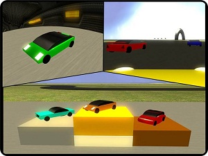
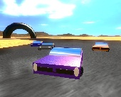
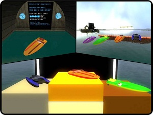
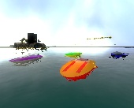
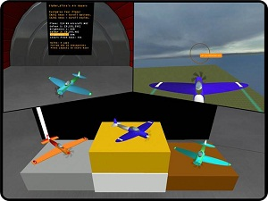
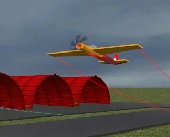

# Advanced Duplicator - [E2] Holo Racing Minigames

## Details

### Author

- Author: Cipher_Ultra
- YouTube: https://www.youtube.com/user/CipherUltra
- Steam Profile: https://steamcommunity.com/profiles/76561197978513282

### Publication Info

- Title: [E2] Holo Racing Minigames
- Date (mm-yyyy): 12-2010
- Source: https://web.archive.org/web/20110118075632/http://www.wiremod.com:80/forum/finished-contraptions/24045-e2-holo-racing-minigames.html
- Source: https://gmods.org/view/567
- Source: https://gmods.org/view/568
- Source: https://gmods.org/view/6754
- Source Accessed (dd-mm-yyyy): 11-08-2025

## Description

### Main Features

- Race Setup Mode
- Realistic acceleration and handling physics
- Automated Checkpoints and Scoring

### E2 Holo Track Racers

  
  

<!--

-->

- 12 different Cars and Colours
- Three car types with different driving styles
- Cars can drift!

### E2 Holo Boat Racers

  
  

<!--

-->

- 4 different Boats and full colour spectrum
- Realistic boat physics
- Dynamic checkpoint system allows for custom built circuits

### E2 Holo Air Racers

  
  

<!--

-->

- 4 different Planes and full colour spectrum
- Realistic Plane physics
- Dynamic checkpoint system allows for custom built circuits
