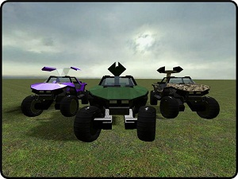

# Advanced Duplicator - M12 Warthog - Halo series

## Details

### Author

- Author: Cipher_Ultra
- YouTube: https://www.youtube.com/user/CipherUltra
- Steam Profile: https://steamcommunity.com/profiles/76561197978513282

### Publication Info

- Title: M12 Warthog - Halo series
- Date (mm-yyyy): 14-01-2011
- Source: https://web.archive.org/web/20160503034106/http://www.wiremod.com:80/forum/finished-contraptions/24367-m12-warthog-halo-series.html
- Source: https://web.archive.org/web/20190819194046/http://www.cipher-ultra.com/gmod/land/warthog.html
- Source: https://web.archive.org/web/20120522074317/http://www.garrysmod.org/downloads/?a=view&id=116434
- Source: https://www.youtube.com/watch?v=iTC8-rf3Lwg
- Source: Thanks to a player for sharing the files :>
- Source Accessed (dd-mm-yyyy): 24-08-2025

## Description

### M12 "Warthog" FAV from Halo

> [!NOTE]
> If the car holograms dont load correctly, reload the upper "Warthog parts" expression 2 on the dashboard.

This is an adv_dupe pack with 4 types of my M12 "Warthog" FAV from Halo



### Features

```plaintext
• Smooth ride on or off road, with E2 holo wheels and suspension
• Military versions have accurate minigun or missile turret
• Civilian version has gullwing doors
• Multiple camouflage styles and civilian paint colours
• A/D or Mouse Steering toggle
• Music Track Player
```

### HD Video

[YouTube - Halo M12 Warthog for Garry's Mod](https://www.youtube.com/watch?v=iTC8-rf3Lwg)

### Requires

Wiremod, wire extras etc,  
including Expression 2 <!-- - i.e. Latest SVN -->

### Instalation

Installation and driving instructions are in the readme. READ IT!!! :)

```plaintext
Gun Turret        =  warthog gun.txt  
Missile Launcher  =  warthog missile.txt  
Gullwing Doors    =  warthog doors.txt  
Basic             =  warthog plain.txt
```
