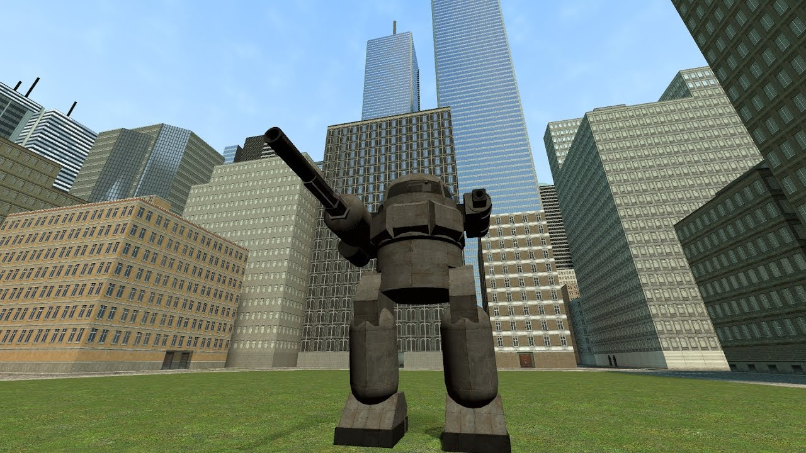

# Advanced Duplicator 2 - DakTek Urbanmech

## Details

### Author

- Author: Dakota
- Steam Profile: https://steamcommunity.com/profiles/76561198035645276
- YouTube: https://www.youtube.com/@dakota0000001

### Publication Info

- Title: DakTek Urbanmech
- Date (dd-mm-yyyy): 22-04-2017
- Source: https://www.dropbox.com/scl/fi/saknt5qzchzzyq4j1fyx6/DakTek-Urbanmech.txt?rlkey=901t9n5yx9dmsffs1y4npps6z&e=1&dl=0
- Source: https://www.youtube.com/watch?v=Dpeoey-tA2k
- Source: https://steamcommunity.com/sharedfiles/filedetails/?id=909795638
- Source Accessed (dd-mm-yyyy): 10-01-2026

## Description

  

<!--  -->

I am giving out a public mech for people to use that is prebuilt. Instructions on how to download and use it below.

You will need advanced duplicator 2 to open it in gmod, AD2 can be found here:  
https://steamcommunity.com/sharedfiles/filedetails/?id=773402917&searchtext=advanced+duplicator+2

Rather than copy and pasting the info of the file yourself into a text file I have done it for you and you can download that file here.  
https://www.dropbox.com/scl/fi/saknt5qzchzzyq4j1fyx6/DakTek-Urbanmech.txt?rlkey=901t9n5yx9dmsffs1y4npps6z&e=1&dl=0

Once you download the file you must place it into  
Steam\steamapps\common\GarrysMod\garrysmod\data\advdupe2

This folder will only exist if you've used AD2 before, so if you haven't then get AD2, spawn a prop, copy and save it, then the folder should exist.
