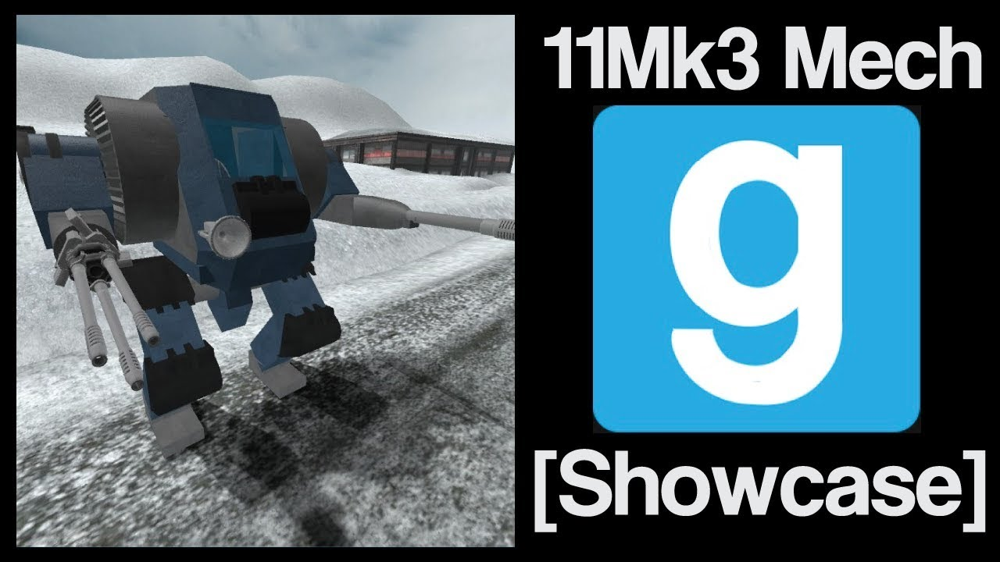

# Advanced Duplicator 2 - ACF 11Mk3 Mech

## Details

### Author

- Author: Tsunkas
- Steam Profile: https://steamcommunity.com/profiles/76561198019477661
- YouTube: https://www.youtube.com/@Tsunkas

### Publication Info

- Title: [Showcase] Gmod ACF "11Mk3" Mech (Download)
- Date (dd-mm-yyyy): 13-01-2018
- Source: https://www.mediafire.com/file/171a68zwnrqbhxz/11mk3%20mech%20by%20tsunkas.txt
- Source: https://www.youtube.com/watch?v=1rZSNzC0N20
- Source Accessed (dd-mm-yyyy): 10-01-2026

## Description

  

<!--  -->

A Bulky Mech its around 50 tons. Pretty fast and stable.  
75mm HW and 3x 25mm SA

It's been a while since i uploaded something, sorry bout that.  
i will make a tutorial on how to make a similar mech.  
Thumbnail is missing for now RIP

You will need to have visual clip tool

Download link: https://www.mediafire.com/file/171a68zwnrqbhxz/11mk3%20mech%20by%20tsunkas.txt
