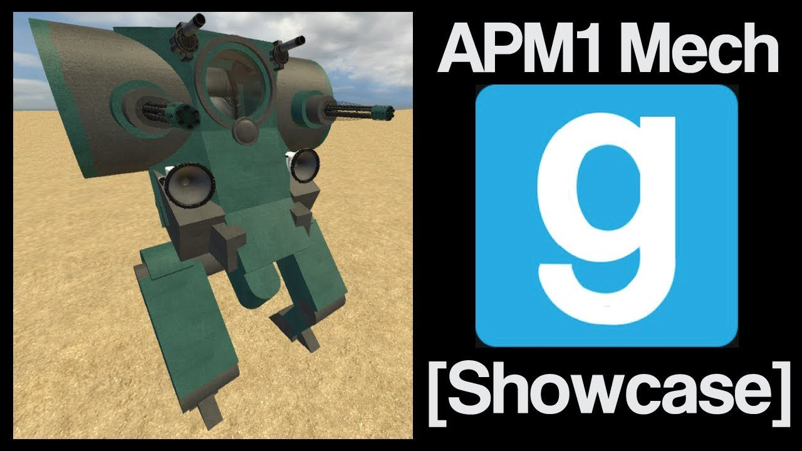

# Advanced Duplicator 2 - ACF APM1 Mech

## Details

### Author

- Author: Tsunkas
- Steam Profile: https://steamcommunity.com/profiles/76561198019477661
- YouTube: https://www.youtube.com/@Tsunkas

### Publication Info

- Title: [Showcase] Gmod ACF "APM1" Mech (Download)
- Date (dd-mm-yyyy): 14-01-2018
- Source: https://www.mediafire.com/file/6ehgyq7c2grh74l/apm1%20mech%20by%20tsunkas.txt
- Source: https://www.youtube.com/watch?v=q1i5qHuyke4
- Source Accessed (dd-mm-yyyy): 10-01-2026

## Description

  

<!--  -->

Anti Personnel Mech 1  
A light Wierd looking mech, this one uses new 14.5mm RAC so you will need the newest version of ACF to use it.  
Added a new thing, A Range finder usefull if you want to bombard someone with those 2 40mm GLs max range is around 190 meters.

Download Link  
https://www.mediafire.com/file/6ehgyq7c2grh74l/apm1%20mech%20by%20tsunkas.txt
