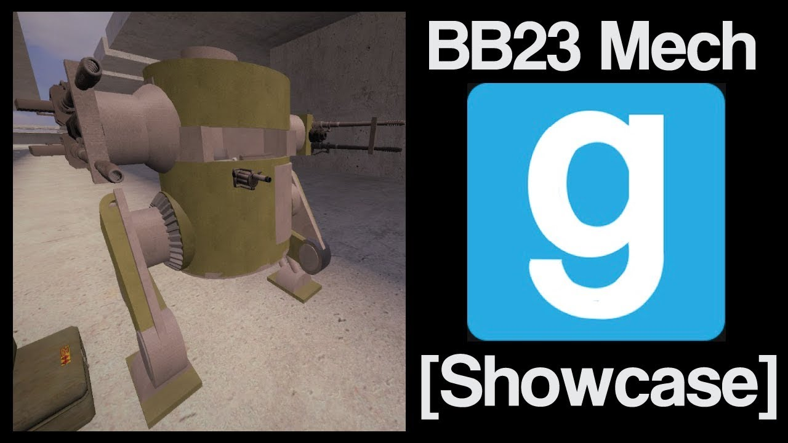

# Advanced Duplicator 2 - ACF BB23 Mech

## Details

### Author

- Author: Tsunkas
- Steam Profile: https://steamcommunity.com/profiles/76561198019477661
- YouTube: https://www.youtube.com/@Tsunkas

### Publication Info

- Title: [Showcase] Gmod ACF "BB23" Mech (Download)
- Date (dd-mm-yyyy): 13-01-2018
- Source: https://www.mediafire.com/file/ayfhsqlhyfhav85/bb23%20mech%20by%20tsunkas.txt
- Source: https://www.youtube.com/watch?v=qNfYfUYBZLY
- Source Accessed (dd-mm-yyyy): 10-01-2026

## Description

  

<!--  -->

A Barrel shaped mech offers good protection from all sides.  
the 4 37mm SA Guns are meant for shooting sides of tanks and the gl is used for shooting over walls or as anti personel

Download link:  
https://www.mediafire.com/file/ayfhsqlhyfhav85/bb23%20mech%20by%20tsunkas.txt
