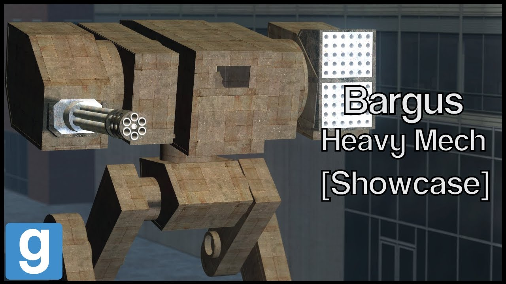

# Advanced Duplicator 2 - DakTek Bargus Heavy mech

## Details

### Author

- Author: Tsunkas
- Steam Profile: https://steamcommunity.com/profiles/76561198019477661
- YouTube: https://www.youtube.com/@Tsunkas

### Publication Info

- Title: [Showcase] Gmod DakTek "Bargus" Heavy mech (Download)
- Date (dd-mm-yyyy): 03-04-2020
- Source: https://www.dropbox.com/scl/fi/7qena7yembl7a0zqo55j4/bargus.txt?rlkey=ln10d09xwe5wyvvhybpxu56n8&e=1&dl=0
- Source: https://www.youtube.com/watch?v=Bl1tsN4LTXA
- Source Accessed (dd-mm-yyyy): 10-01-2026

## Description

  

<!--  -->

A Heavy Mech with a huge missile rack and a strong RAC20, the mech versing it will also be uploaded later. The biggest weakness to this mech are his legs.

Mods required:  
(E2 Stream core / required for the extra sounds)

Download link:  
https://www.dropbox.com/scl/fi/7qena7yembl7a0zqo55j4/bargus.txt?rlkey=ln10d09xwe5wyvvhybpxu56n8&e=1&dl=0

To install just put it in your advance dupe 2 folder
