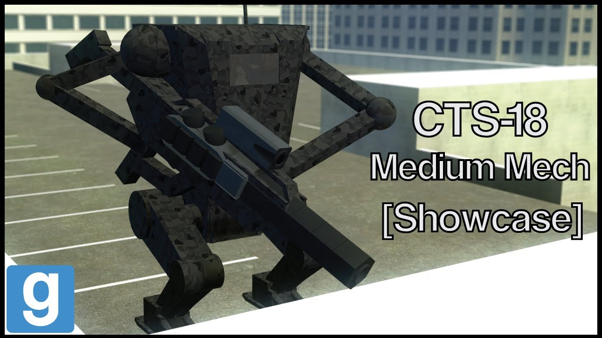

# Advanced Duplicator 2 - DakTek CTS-18 Medium mech

## Details

### Author

- Author: Tsunkas
- Steam Profile: https://steamcommunity.com/profiles/76561198019477661
- YouTube: https://www.youtube.com/@Tsunkas

### Publication Info

- Title: [Showcase] Gmod DakTek "CTS-18" Medium mech (Download)
- Date (dd-mm-yyyy): 02-04-2020
- Source: https://www.dropbox.com/scl/fi/qae4zjtsu76y5r4ny7ytu/cts18.txt?rlkey=e65cn06ocgje8h1g39a2t11q2&e=1&dl=0
- Source: https://www.youtube.com/watch?v=Uz24SD5rIAo
- Source Accessed (dd-mm-yyyy): 10-01-2026

## Description

  

<!--  -->

No way im back? Yup and more than 6 mechs coming too!  
With a modified base chip that plays sounds!  
The "arms" where a struggle to make, and the body looks kinda crap because it's just a prototype anyway but in the end i just like it.

Mods required:  
(E2 Stream core / required for the extra sounds)

Download link:  
https://www.dropbox.com/scl/fi/qae4zjtsu76y5r4ny7ytu/cts18.txt?rlkey=e65cn06ocgje8h1g39a2t11q2&e=1&dl=0

To install just put it in your advance dupe 2 folder
