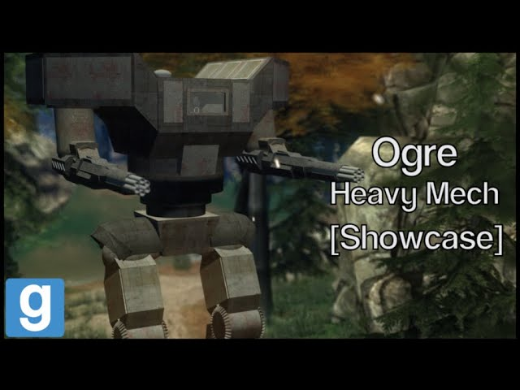

# Advanced Duplicator 2 - DakTek Ogre Heavy mech

## Details

### Author

- Author: Tsunkas
- Steam Profile: https://steamcommunity.com/profiles/76561198019477661
- YouTube: https://www.youtube.com/@Tsunkas

### Publication Info

- Title: [Showcase] Gmod DakTek "Ogre" Heavy mech (Download)
- Date (dd-mm-yyyy): 24-05-2020
- Source: https://www.youtube.com/watch?v=zUEX0zm4sOs
- Source: https://www.dropbox.com/scl/fi/wlcrzukvm189tcbm1hvup/Ogre.txt?rlkey=mrg8a8yh6gm04xydfb4ps5nx5&e=1&dl=0
- Source Accessed (dd-mm-yyyy): 10-01-2026

## Description

  

<!--  -->

A big scary looking mech with 2 strong rotary autocannons
 wich put out massive dps! It's also pretty fast for a heavy mech. No jump jets!

Videos are delayed because of my school work.

Mods required:
(E2 Stream core / required for the extra sounds)

Download link: https://www.dropbox.com/scl/fi/wlcrzukvm189tcbm1hvup/Ogre.txt?rlkey=mrg8a8yh6gm04xydfb4ps5nx5&e=1&dl=0

To install just put it in your advance dupe 2 folder
