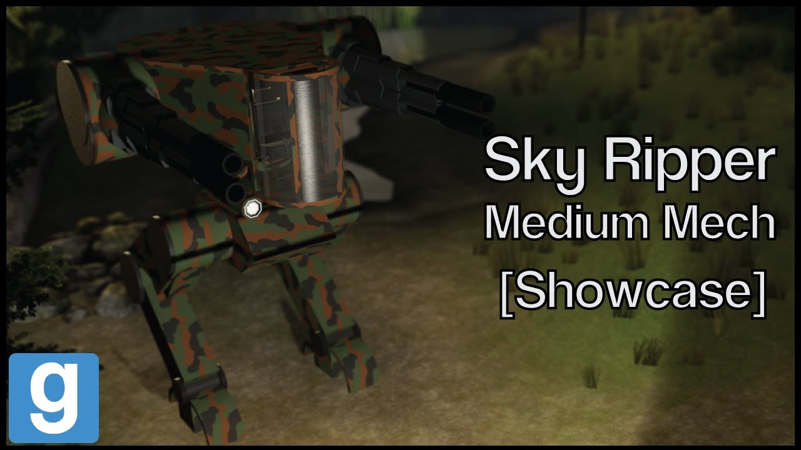

# Advanced Duplicator 2 - DakTek Sky Ripper Medium mech

## Details

### Author

- Author: Tsunkas
- Steam Profile: https://steamcommunity.com/profiles/76561198019477661
- YouTube: https://www.youtube.com/@Tsunkas

### Publication Info

- Title: [Showcase] Gmod DakTek "Sky Ripper" Medium mech (Download)
- Date (dd-mm-yyyy): 28-05-2020
- Source: https://www.dropbox.com/scl/fi/kqry4lxhexkv3v8joddpy/skyripper.txt?rlkey=ggcoa9t41r47gdyi5ieoaa74l&e=1&dl=0
- Source: https://www.youtube.com/watch?v=xX9X9kmBOHE
- Source Accessed (dd-mm-yyyy): 10-01-2026

## Description

  

<!--  -->

A deadly high dps AA mech, although it's an AA mech it can still fight other mechs, it's armed with 4 autocannons so it has insane firerate. The only drawback with that is when you shoot, you literally don't see what are you shooting at. Pressing "r" will switch the ammo to incendiary rounds. Pressing "Crtl" toggles the flashlight.

Videos are delayed because of my school work.

Mods required:  
(E2 Stream core / required for the extra sounds)

Download link:  
https://www.dropbox.com/scl/fi/kqry4lxhexkv3v8joddpy/skyripper.txt?rlkey=ggcoa9t41r47gdyi5ieoaa74l&e=1&dl=0

To install just put it in your advance dupe 2 folder
