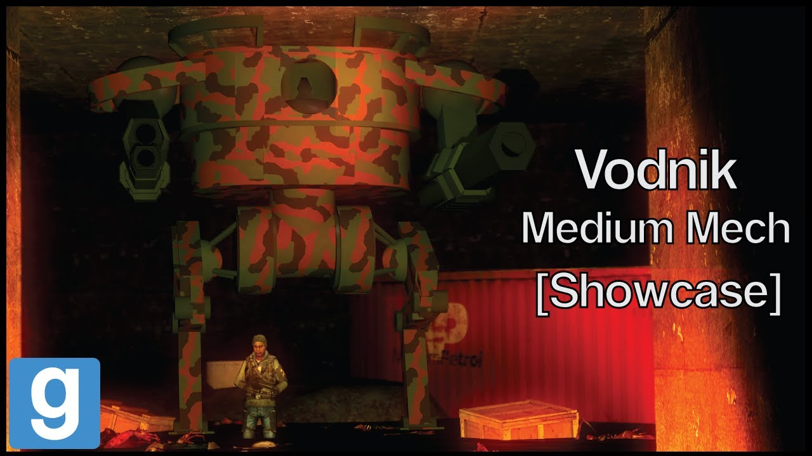

# Advanced Duplicator 2 - DakTek Vodnik Medium mech

## Details

### Author

- Author: Tsunkas
- Steam Profile: https://steamcommunity.com/profiles/76561198019477661
- YouTube: https://www.youtube.com/@Tsunkas

### Publication Info

- Title: [Showcase] Gmod DakTek "Vodnik" Medium mech (Download)
- Date (dd-mm-yyyy): 25-05-2020
- Source: https://www.dropbox.com/scl/fi/pn63qotzzzporpebeae4i/Vodnik-OG.txt?rlkey=sq25d1mjjyteti3v83er80t8z&e=1&dl=0
- Source: https://www.youtube.com/watch?v=uNyP1khIAb4
- Source Accessed (dd-mm-yyyy): 10-01-2026

## Description

  

<!--  -->

A Russian like mech pretty big for a medium mech, has 2 laser burners for infantry and a gauss rifle for sniping. Walking animation do be weird tho.

Videos are delayed because of my school work.

Mods required:  
(E2 Stream core / required for the extra sounds)

Download link:  
https://www.dropbox.com/scl/fi/pn63qotzzzporpebeae4i/Vodnik-OG.txt?rlkey=sq25d1mjjyteti3v83er80t8z&e=1&dl=0

To install just put it in your advance dupe 2 folder
