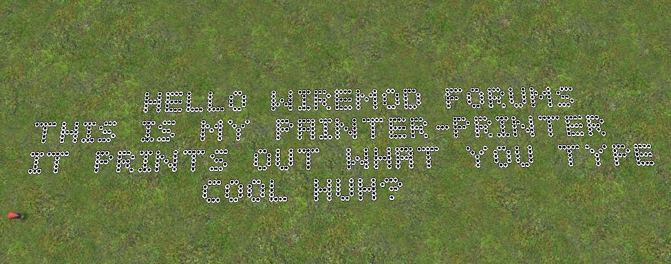
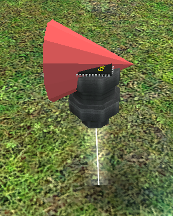

# Expression Advanced 2 - [Expadv 2] Painter text

## Details

### Author

- Author: Orzlar
- Steam Profile: https://steamcommunity.com/profiles/76561198004532880
- Github: https://github.com/Orzlar

### Publication Info

- Title: [Expadv 2] Painter text
- Date (dd-mm-yyyy): 16-02-2015
- Source: https://web.archive.org/web/20150508092558/http://www.wiremod.com/forum/finished-contraptions/34069-expadv-2-painter-text.html
- Source Accessed (dd-mm-yyyy): 20-08-2025

## Description

### The Text - Painter Printer

### Commands

```plaintext
-print <message>     Adds message tobe printed ( Acts as a buffer, so you can stack )
-here                      Moves the printer to your aimPos
-debug                    Will print every charecter possible
```

### About

Basically you simply stick it on top of a wire_painter, wait for it to load, then type -debug.  
(Make sure you have weld ticked for EA2 else it can't detect the painter ( and won't load ) )

Once its finished printing type -print \<message\>  
Use only what the debug shows, as invalid char's will put it in an endless loop  
You can also move it around using -here to quickly move it to your aimPos

Also, Thanks HATI for help with the font ( Making my font look as cool as it is! )

As always, feel free to edit and modify.



