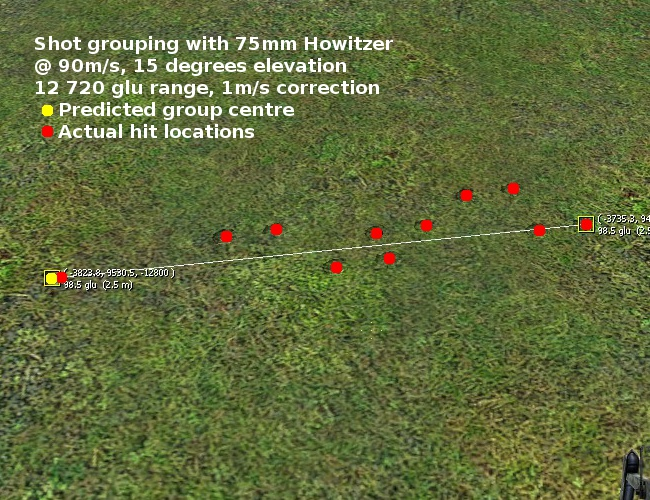
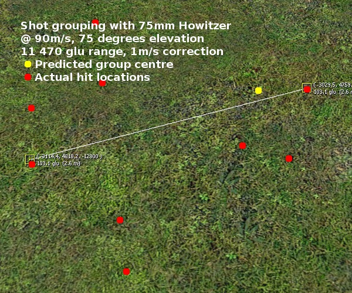
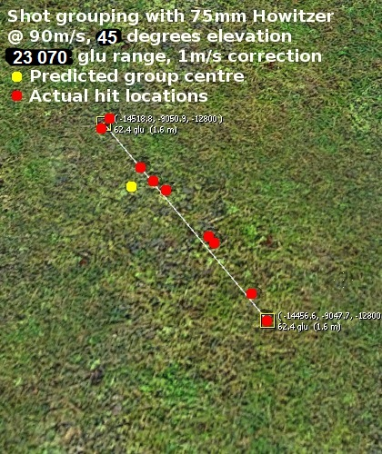

# Expression 2 - ACF Bulletometer 2

## Details

### Author

- Author: Bubbus (Splambob)
- Github: https://github.com/bubbus
- Steam Profile: https://steamcommunity.com/profiles/76561197970677684
- YouTube: https://www.youtube.com/@Splambob

### External publisher

- Publisher: GMODISM
- Website: https://gmodism.com
- Reddit: https://www.reddit.com/r/GMODISM/
- Steam Profile: http://steamcommunity.com/profiles/76561198056037449
- YouTube: https://www.youtube.com/Gmodism
- Pastebin: https://pastebin.com/u/Gmodism

### Publication Info

- Title: ACF Bulletometer 2
- Date (dd-mm-yyyy): 31-05-2013
- Source: https://web.archive.org/web/20150304052657/http://www.wiremod.com/forum/finished-contraptions/31833-acf-bulletometer-2-a.html
- Source2: https://pastebin.com/X9TKZiLT
- Source2: https://www.youtube.com/watch?v=p-cm2zwp9gI
- Source Accessed (dd-mm-yyyy): 24-08-2025

## Description

Since the ACF E2 extension was released, I've tweaked this chip to take advantage. As before, I've decided to release this to level the playing field.

This is a chip that calculates where your ACF guns will hit. It's quite accurate, but there's some deviation for slow-moving shells like mortars and grenades. If you tweak the Correction value for these situations it can become accurate enough for any purpose.

Be aware, the longer your shells will stay in the air (slow moving shells on a high arc), the more ops this chip will use. Sometimes if you're using a very slow shell and a very high Precision value, the calculation may time out and stop in the air. This is to stop the chip lagging other people - please be considerate to your fellow players!

This chip only needs to be linked to a gun to function: it reads the ammo data from the gun using ACF's E2 functions. It also dynamically adapts to new input; for example if you have a cannon and a mortar on your tank you can swap the Gun input to get new aimpoints dynamically.

This chip also includes a DoHolos mode which uses holograms to draw the trajectory with coloured dots which indicate shell speed relative to initial speed.

Please read the documentation at the top of the script. It'll explain how to set up the chip and how to optimize it for your weapon.

Troubleshooting;
"My hit position is weird/null!"
ACF guns start empty until you reload them. Also, this chip only re-calculates the hit position if the Gun moves (to save ops). Try moving the gun to get a fresh hitpos.

Here are some results from my testing of the chip:

  
   
  
  

<!--

-->
