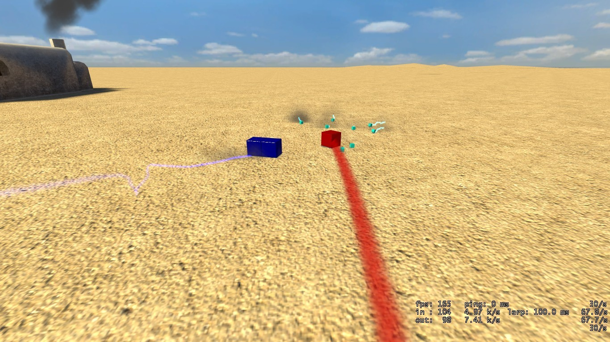
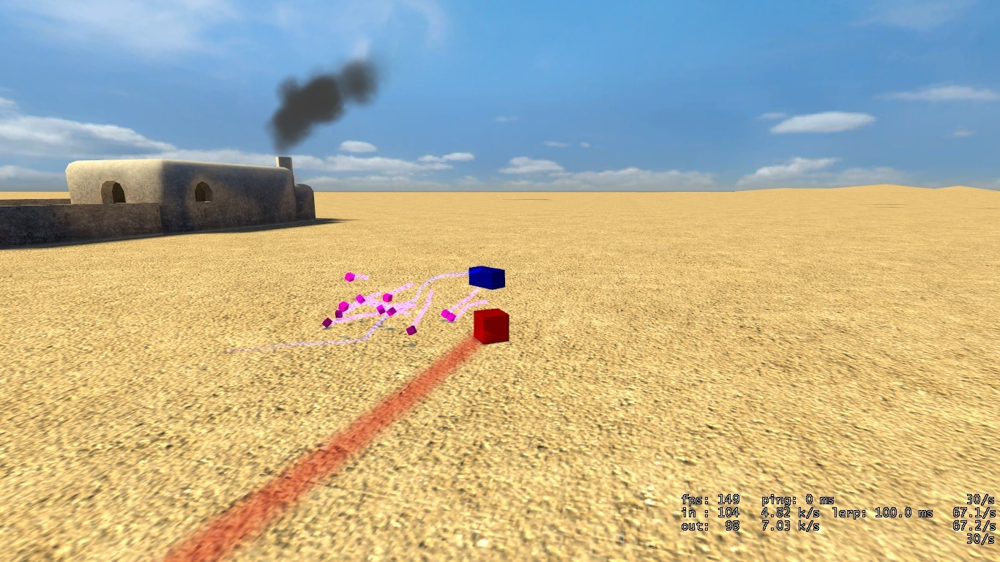
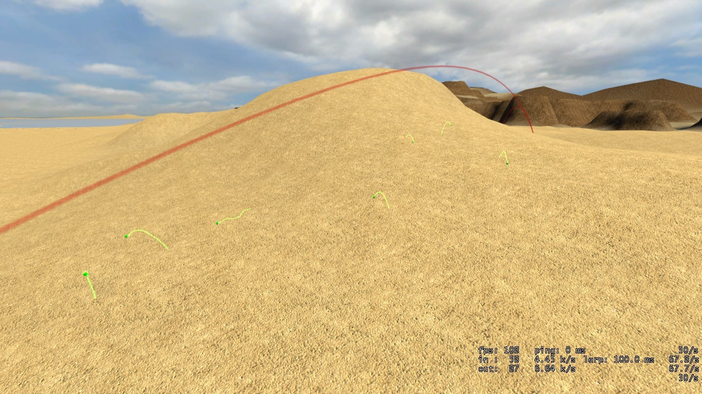

# Expression 2 - Bugz 2.4 (release)

## Details

### Author

- Author: postman ([TBU-TEC] THE P)
- Steam Profile: https://steamcommunity.com/profiles/76561197997916844
- YouTube: https://www.youtube.com/@blankrofl

### Publication Info

- Title: Bugz 2.4 (release)
- Date (dd-mm-yyyy): 14-05-2011
- Source: https://web.archive.org/web/20110809084016/http://www.wiremod.com/forum/finished-contraptions/25904-bugz-2-4-release.html#post234733
- Source Accessed (dd-mm-yyyy): 30-08-2025

## Description

Hello all, today im releasing bugz version 2.4.

<!-- I have a thread on this, for version 2.3, but its in the wrong section, so im going to make a new thread here. -->

The chip creates a alpha(mother) bug, and a beta(father) bug. When the dad gets close to the mom, they mate, and little bugs are created.

### what it does

The expression is the leader bug, it will wander around, until betabug, finds it, and they will mate, making little bugs, that will follow alpha.

The alpha has a limited, random food supply, so, if theres to many bugs, they start to die off until alpha can support them all.

If they get to far away from alpha, they will become "lost" bugs, and will wander looking for an alpha, they will die fairly fast from hunger.

### what types are there?

```plaintext
• Alphabug(red)(Aka:Leader bug, its the e2 chip)
• Betabug(blue)(Aka:creeper joe, its the blue rectangular prism thing.)
• Omegabug(s)(white/blue)
• Lostbug(s)(green)
```

### What do i need to use this?

```plaintext
• Wiremod.
• Wire extras.(for propcore)
• Phx(for the models)
```

### Features?

```plaintext
• ALpha bug will hop around, going who knows where
• Betabug will stalk alpha, until he gets close enough to "make his way" with alpha.
• A random # of baby bugs will be made.
• If theres bugs when alpha is mating, they will dance around alpha, being purple.
• A hunger system, bugs will die if theres not enough food(Amount judged by how many bugs there are)
• Lost bugs will be lost, and die
```

### What im adding later on..

I plan to after this, add a system of "bad" bugs, that wander around and attack alpha, then perhaps get eaten or something.

A way to capture bugs, i already have a control system working, i just need to set it up

And anything else i can think of.

### Images

<p float="left">
  
  
  
</p>

<!--


-->

<!-- ### Video

[E2 Bugs - Xfire Video](https://web.archive.org/web/20110809084016/http://www.xfire.com/video/37ab73/) -->

### Whats new in 2.4?

Complete COMPLETE rewrite of the code, it is now more efficient, modular, and easyer for me to add new things.

<!-- I will update this thread when i make future changes -->
