# Expression 2 - Chip-8 Emulator 99% Speed and Compatability (Code & Dupe in thread)

## Details

### Author

- Author: Technicolour (Techni)
- Steam Profile: https://steamcommunity.com/profiles/76561197983168201
- YouTube: https://www.youtube.com/@Technicolour777

### Publication Info

- Title: Chip-8 Emulator 99% Speed and Compatability (Code & Dupe in thread)
- Date (dd-mm-yyyy): 14-11-2010
- Source: https://web.archive.org/web/20101117015858/http://www.wiremod.com/forum/finished-contraptions/23515-chip-8-emulator-99-speed-compatability-code-dupe-thread.html
- Source Accessed (dd-mm-yyyy): 09-08-2025

## Description

After hitting a roadblock on my GB emulator I decided to start a bit lower, a Chip 8 Emulator coded entirely in E2, runs 100% without unlimited 1. Originally, like the GB emulator this was merely meant to be a proof of concept but after writing it, debugging it and optomising it like fuck I've actualy got it to more or less 100% speed of a real Chip 8, and alot of games are not only fully playable but pretty damn fun.

Chip 8 is essentialy a virtual machine developed for a few computers back in the 1970's. Here are a few specifications:

- 4KB of Addressable memory, 0x0 to 0x1FF are reserved but can be used for fonts.
- 32x64 monocolour display
- 16 8bit registers
- 2 12bit registers
- a 12bit wide stack
- 35 16 bit instructions

More info: [CHIP-8 - Wikipedia, the free encyclopedia](https://en.wikipedia.org/wiki/CHIP-8)

My emulator currently emulates all but 1 (Difficult to impliment but rarely ever used) of the chip 8's instructions, most games work fully although due to the missing instruction a couple of them freeze. Tetris, Space Invaders, Pong and Astrododge (The best games) all work fully. Input is realised with the numpad currently, the Chip-8 has 16 input keys and each game uses them different, I'll end up adding customised controls for each game but not now. The flickering is more-or-less inherent to Chip 8 and the digital screen just makes it worse but playing with the timers might calm it down, I'll have to see.

- Sound is fully emulated
- Memory and Stack are fully emulated
- Video is fully emulated
- All registers and all but one opcode are fully emulated
- Input is fully emulated

You can switch between games by typing !load gamename. Here's a list of game names and any relevent information. Likewise there are several demos for testing the Chip 8 emulator and displaying its capabilities.

### Arcade Games

```plaintext
• Pong #Works perfectly 2 Player
• Pong2 #Works perfectly 2 player
• Pacman #Wierd ass controls but works perfectly
• Astrododge #Works perfectly
• Tetris #Works perfectly
• Space invaders# Works perfectly
• Blitz # Works perfectly
• Worm #Works perfectly
• Vbrix #Works perfectly
• Tank #Works perfectly

• SYZYGY #Works perfectly but really boring play Worm instead
• brix #Works but meh
• WIPEOFF #Works but I don't understand the point, play brix or vbrix
• Missile #Works but boring
• UFO #Works but no idea what you're supposed to do
• VERS #2 player, works fine, but lame gameplay

• Rush Hour #Hangs at menu
```

### Demos/Test roms

```plaintext
• Pic
• IBM
• zero
• sirpinski
• maze
• test
```

### Puzzle games

```plaintext
• Hidden
• TicTac #Two player
• puzzle15
• puzzle
• connect4 #2 player
• guess
• KALEID
• Merlin
```

All Roms are contained within the E2 and are in the public domain, there are no legal issues.

### Pictures

<p float="left">
  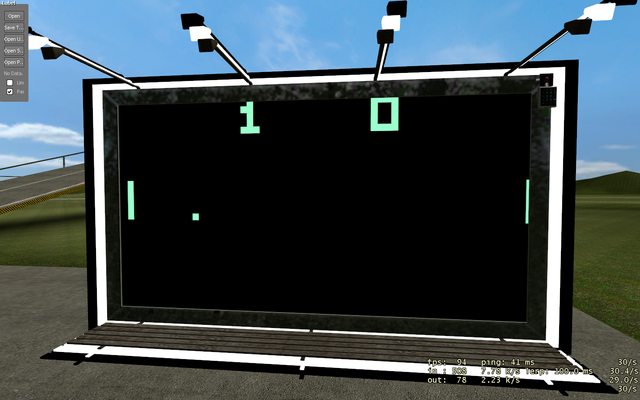
  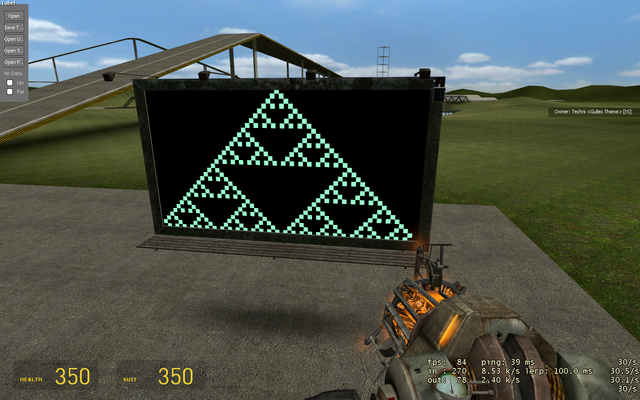
  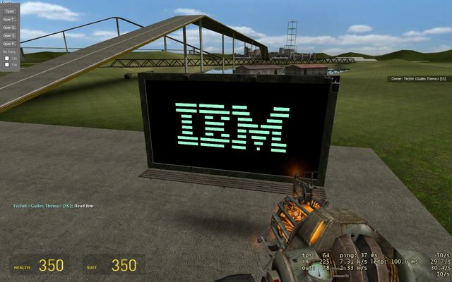
  <br/>
  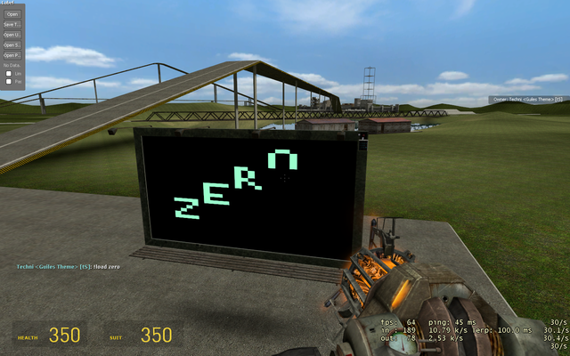
  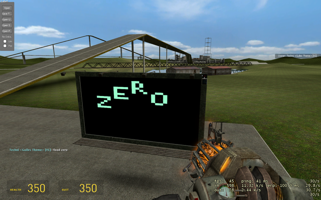
  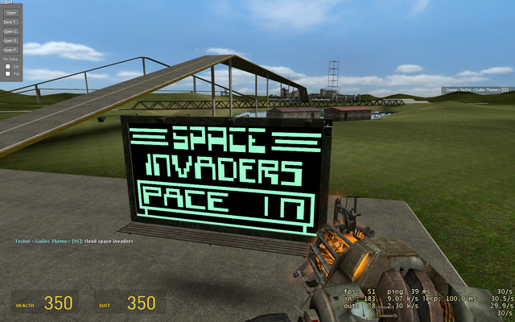
  <br/>
  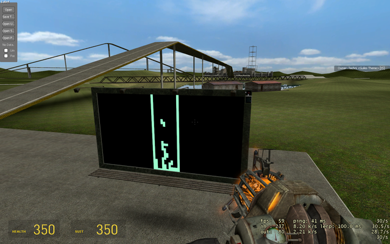
  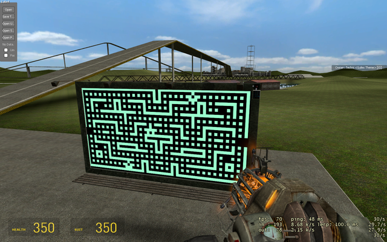
  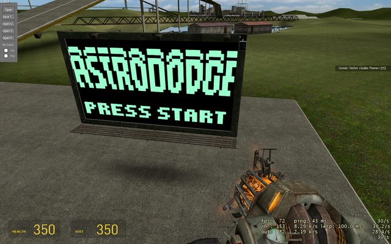
  <br/>
  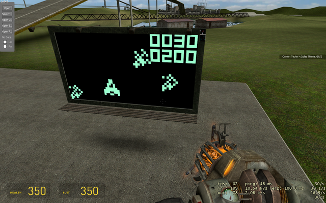
  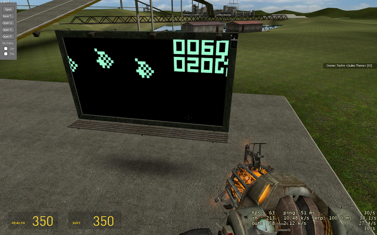
  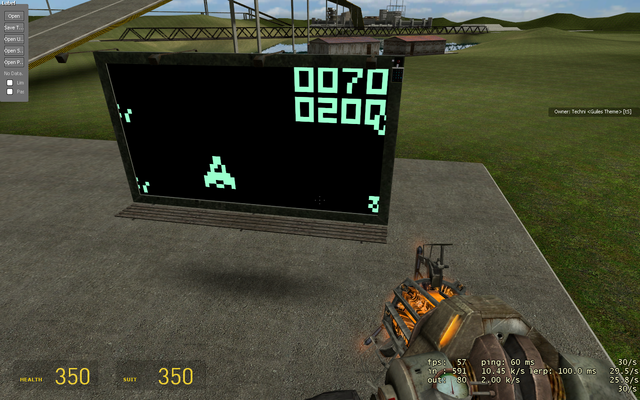
  <br/>
  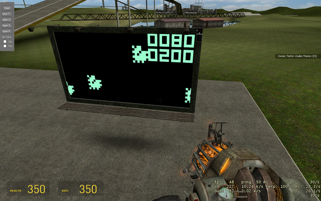
  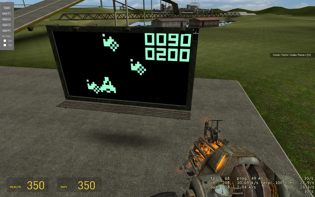
  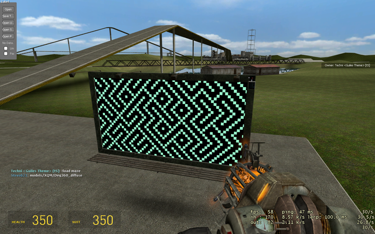
</p>

<!--


-->

### Code

E2 Code, to use wire the Screen to a digital screen and the Pad to a wired numpad.

Thanks to Divran and dlb for helping me out with some optomisations and initrd.gz for adding hexidecimal support to E2, made my life alot easier.
