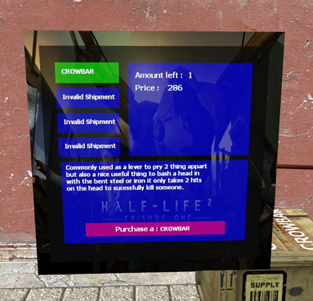
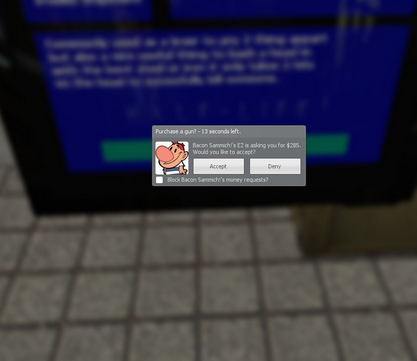

# Expression 2 - [E2 Release] Simple 4 slot Gunshop e2

## Details

### Author

- Author: Bacon Sammich!

### Publication Info

- Title: [E2 Release] Simple 4 slot Gunshop e2
- Date (dd-mm-yyyy): 31-10-2014
- Source: https://web.archive.org/web/20150429003022/http://www.wiremod.com/forum/finished-contraptions/33694-e2-release-simple-4-slot-gunshop-e2.html
- Source Accessed (dd-mm-yyyy): 25-08-2025

## Description

Hello guys! im new to e2 and this has been my second e2 that i have finished my first publicly released my second e2 will be soon to be posted

### Features

- Automatic price setting
- Anti money theft
- Simple and easy to use
- Free

  
  
   
  
  

<!--

-->

Just finished it, needs 2 custom e2 functions to work  
[TylerB's Custom Money Request E2 Functions Workshop Page](https://web.archive.org/web/20150429003022/http://steamcommunity.com/sharedfiles/filedetails/?id=259174593)  
[TylerB's Custom Shipment E2 Functions Workshop Page](https://web.archive.org/web/20150429003022/http://steamcommunity.com/sharedfiles/filedetails/?id=217722743)
