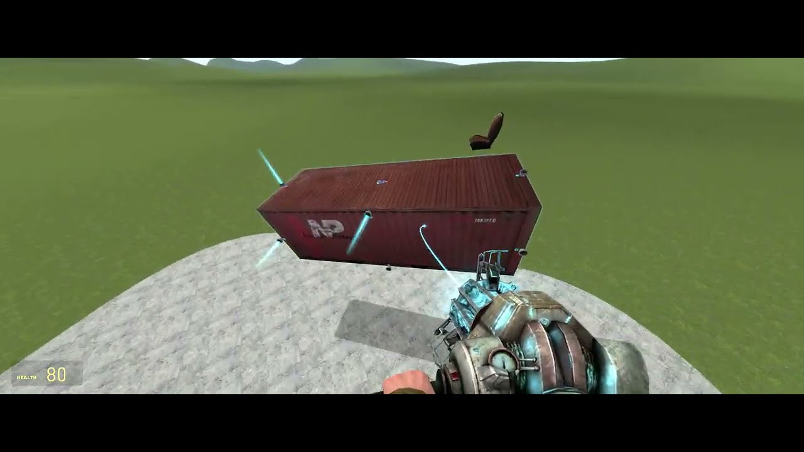
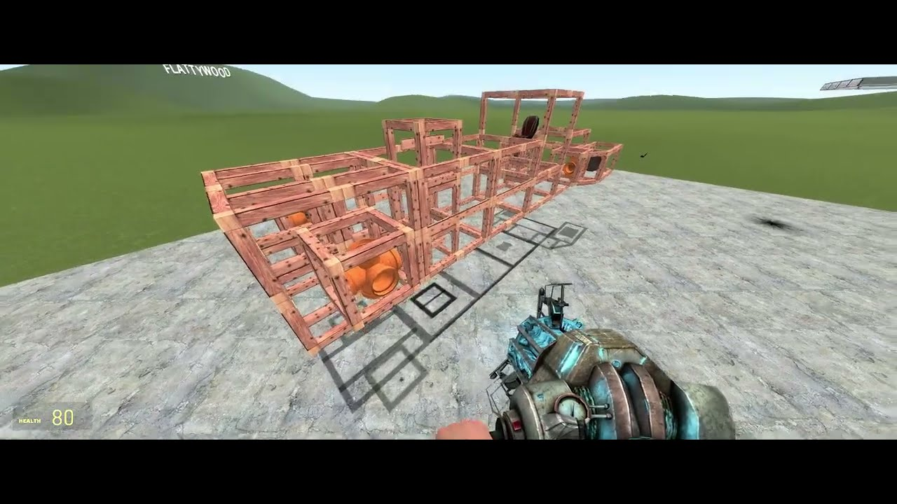

# Expression 2 - Garry's Mod Spacecraft Thruster Controller E2

## Details

### Author

- Author: Papa Marsh
- Steam Profile: https://steamcommunity.com/profiles/76561198011601596
- YouTube: https://www.youtube.com/@BenjaminMarshallScienceMan

### Publication Info

- Title: Garry's Mod Spacecraft Thruster Controller E2
- Date (dd-mm-yyyy): 11-02-2023
- Source: https://www.youtube.com/watch?v=DLy6NUSoNts
- Source: Papa Marsh Industries Discord: the-archives
- Source Accessed (dd-mm-yyyy): 15-08-2025

## Description

Video: [YouTube - Garry's Mod Spacecraft Thruster Controller E2](https://www.youtube.com/watch?v=DLy6NUSoNts)

This E2 code I wrote intelligently controls all the thrusters on a spacecraft in order to allow for rotations & translations, as well as angular and lateral stabilization.

