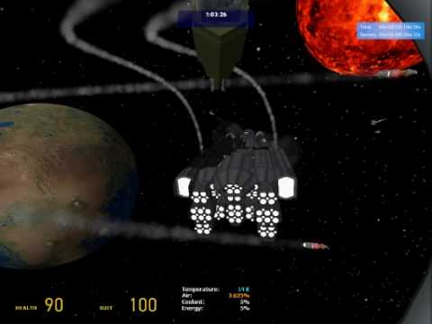
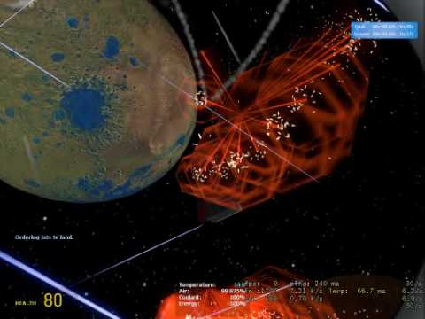
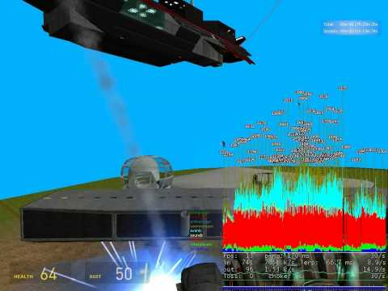

# Expression 2 - Fearsome spacebuild frigate-class carrier

## Details

### Author

- Author: Paper Clip (glmcd) (glmcdona21) (glmcdona)
- Steam Profile: https://steamcommunity.com/profiles/76561197990877852
- YouTube: https://www.youtube.com/@glmcdona21

### Publication Info

- Title: Fearsome spacebuild frigate-class carrier
- Date (dd-mm-yyyy): 06-04-2010
- Source: https://web.archive.org/web/20110425081431/http://www.wiremod.com/forum/finished-contraptions/19276-fearsome-spacebuild-frigate-class-carrier.html
- Source: https://www.youtube.com/watch?v=48gGbpWWWrM
- Source: https://www.youtube.com/watch?v=8eaJpYEybpw
- Source: https://www.youtube.com/watch?v=SE7PfgocE6o
- Source2: https://www.reddit.com/r/wiremod/comments/csynke/anyone_wanna_share_any_e2s/
- Source2: https://www.dropbox.com/s/2frjtqqz1cvbraj/E2s.zip?dl=0
- Source Accessed (dd-mm-yyyy): 25-08-2025

## Description

### EDIT: SIMPLIFIED E2 AND USAGE INSTRUCTIONS for carrier_fighter_controller_simplified.txt:

Download this e2 file: carrier_fighter_controller_simplified.txt

I added a simplified version of the fighter control e2 chip to the post, feel free to make your own carrier! This is really easy to use and this e2 will work on any server with up-to-date wiremod.

#### Chat Commands:

- `orbit` -> This tells the fighters to take off and orbit your carrier.
- `land` -> This tells the fighters to land.
- `attack {name or part of name}` -> This tells the fighters to attack the specified player. Eg. "attack Pap" would tell them to attack me, Paper Clip.

#### Here is how it is wired up:

- `@inputs Mouse1 Mouse2`  
Wire these from your adv. pod controller. Mouse 1 will order the fighters to attack any prop it finds forwards from the carrier. Press mouse 1 again to recall the fighters. I don't think Mouse 2 does anything.

- `@inputs ParentLink:wirelink`  
Wire ParentLink directly a prop on you carrier. This prop should have :forward() direction being the forward direction of your carrier. It only uses this input when you press Mouse1 and it searches for targets.

- `@inputs [F1 F2 F3 F4 F5 F6]:wirelink`  
Wire this up directly to the smallest of the PHX Transportation prop jets. F1 if fighter #1, F2 is fighter #2 ect. If you want to make different looking fighters, just build your fighter parented to this jet model and make it invisible.

- `@inputs [L1 L2 L3 L4 L5 L6]:wirelink`  
Wire this up to the landing props. L1 is the landing prop for Fighter #1, it lands where this prop is and orients itself with it when docked. It is best to use a small prop like a helibomb prop.

- `@outputs Fire1 Fire2 Fire3 Fire4 Fire5 Fire6`  
These are the fire signals for each of the fighters. If Fighter #1 is attacking someone and it gets a valid ranger hit on the target, it will set Fire1 to 1.

- `@outputs Targ1:entity Targ2:entity Targ3:entity Targ4:entity Targ5:entity Targ6:entity`  
These are the entities that each of the fighters are attacking, this can be used as inputs to weapons that take an [ENTITY] input.

- `@outputs XYZ1:vector XYZ2:vector XYZ3:vector XYZ4:vector XYZ5:vector XYZ6:vector`  
These are the XYZ coords that each of the fighters are attacking, this can be used as inputs to weapons that take a [VECTOR] input.

**ALSO NOTE:** You need to repaste the e2 for it reload the fighters. So you need to wire the fighters up, then update the e2. It waits about 10 seconds before initializing, this is to avoid initializing while your carrier is still pasting.

---

### Description

This is a fearsome frigate-class carrier spaceship built for serious spacewar pwnage :) I don't recommend trying to get the attached dupe to work on the server you play on, it has quite a few server requirements (See dupe requirements section). Feel free to steal or modify the e2 chip to build your own carrier on your spacebuild server.

### How it Works

- Single E2 chip for controlling all 6 fighters using applyforce running at tick 50 and ~600 ops. This E2 is approximately 500 lines of code and includes basic obstacle avoidance.
- E2 applyforce chip for the flight system of the carrier itself. (See [http://www.wiremod.com/forum/contrap...sign-chip.html](https://web.archive.org/web/20110425081431/http://www.wiremod.com/forum/contraptions-saves/17737-applyangforce-system-identification-dead-beat-controller-design-chip.html) for details)
- E2 chip for point defense against missiles, not shown in movies but included in dupe.
- E2 chip for life support system.

### Dupe Requirements

The dupe has quite a few server requirements to work:

- LS3
- Custom Addon Framework with Laser-Systems: for the lasers transferring the power from carrier to the fighters.
- Weapons: Unique to server: [McBuild Server Info (ip addresses, svn links, map links)](https://web.archive.org/web/20110425081431/http://mc-builds.org/showthread.php?))2704-McBuild-Server-Info-(ip-addresses-svn-links-map-links)
- Prop core: For welding the fighters to the carrier during flight.

### Advanced Dupe

Save the file attached to this post to this folder:  
C:\Program Files\Steam\steamapps\<userName>\garrysmod\garrysm od\addons\Adv Duplicator  
Then use the Adv. Dupe Tool in-game to upload it to the server and paste it.

### Three Battle Videos!

***Thanks to opponent spaceship commanders D4RK3_54B3R.dat and Katelyn*** :)

Newest Video:
[YouTube - Spacebuild Battle #3, Carrier versus titan (Diaspora spacebuild server)](https://www.youtube.com/watch?v=48gGbpWWWrM)



Somewhat New Video:
[YouTube - Spacebuild Battle #2, Carrier versus carrier 2 (Diaspora servers)](https://www.youtube.com/watch?v=8eaJpYEybpw)



Old Video:
[YouTube - Spacebuild Battle #1, Carrier versus carrier short clip](https://www.youtube.com/watch?v=SE7PfgocE6o)



### E2 Code

#### Fighter Controller Chip

This controls all 6 fighters.

- **Inputs:**

    ```plaintext
    Energy <- Energy output of resource cache on a single fighter
    Energy Max <- Energy Max output of resource cache on a single fighter
    Parent:entity <- {Wire->Detection->Entity Marker} linked to the main prop of the carrier. This is used for welding when docked.
    Mouse1 <- Adv. Pod Controller Mouse 1. This tells the jets to attack.
    F1_LasRec:wirelink <- Wired from a wirelink on Fighter #1 Laser Receiver.
    F1_Las:wirelink <- Wired from a wirelink on Fighter #1 Laser. The laser is a laser beam welded to the carrier which transfers power to the laser receiver above. The docked position, takeoff, and landing for fighter #1 is determined by the position and orientation of this laser.
    F2_LasRec:wirelink <- Same as above except Fighter #2.
    F2_Las:wirelink <- Same as above except Fighter #2.
    ...
    ```

- **Outputs:**

    ```plaintext
    Laser -> The lasers sending power to all of the fighters.
    Fire1 through 6 -> Wired up the guns on fighters 1 through 6.
    Targ1:entity -> The entity that fighter #1 is currently targeting. This is used as input for special guns which take a target entity input.
    XYZ1:entity -> The position that fighter #1 is currently targeting. This is used as input for special guns which take a target entity input.
    ```

#### Carrier Flight System

- **Inputs:**

    ```plaintext
    Seat:entity <- Wired from adv. pod controller.
    ```

- **Outputs:**

    ```plaintext
    CamEnable -> Adv. Cam Controller
    CamPos:vector -> Adv. Cam Controller Position
    CamDir:vector -> Adv. Cam Controller Direction
    ```

#### Carrier Point-Defense System

- **Inputs:**

    ```plaintext
    Fire <- I wire this up to Mouse2 on Adv. Pod Controller. This forces the beam cannons to fire.
    Ship:entity <- This is the main prop on my carrier.
    Gun1:wirelink <- A wirelink to beam cannon #1.
    Gun2:wirelink <- A wirelink to beam cannon #2.
    ResourceNode:entity <- A wirelink to my carrier resource node.
    Spin1 <- Output from bean cannon #1.
    Spin2 <- Output from bean cannon #2.
    ```

- **Outputs:**

    ```plaintext
    FireOut1 -> Output to beam cannon #1 fire
    FireOut2 -> Output to beam cannon #2 fire
    ```

---

### Re: Fearsome spacebuild frigate-class carrier

Thanks for all the support guys.

```plaintext
QUOTE: Originally Posted by Sgtkevin
Why do I watch this and feel like the days of my giant spacebuild battleships are numbered. 
Nice carrier man you give me a reason to add even more small anti fighter gun mounts to my ship.
```

In those videos you will see those giant spacebuild battleships owned me  On mcbuilds they use a eve core system which makes large ships really strong in health.

```plaintext
QUOTE: Originally Posted by Blaylock1988
I am curious about the concepts you used to make the object avoidance system. Can you give a simple explanation on that?
```

It is a basic system designed more to stop the fighters from getting stuck. Here the avoidance code in the main fighter processing loop:

```plaintext
################ OBSTACLE AVOIDANCE ##############
        Position = Positions[Index,vector]
        if( Avoidance )
        {
            # Takeover force on jet if we are going to hit something
            
            # Perform our short-distance object avoidance
            RD1 = rangerOffset(200,Fighter:massCenter()+250*Fighter:right(),Fighter:toWorld(vec(0,1,0)))
            RD2 = rangerOffset(200,Fighter:massCenter()+250*Fighter:toWorld(vec(-0.5,1,0)),Fighter:toWorld(vec(1,0,0)))
            RD3 = rangerOffset(200,Fighter:massCenter()+250*Fighter:toWorld(vec(0.5,1,0)),Fighter:toWorld(vec(-1,0,0)))
            RD4 = rangerOffset(200,Fighter:massCenter()+250*Fighter:toWorld(vec(0,1,-0.5)),Fighter:toWorld(vec(0,0,1)))
            RD5 = rangerOffset(200,Fighter:massCenter()+250*Fighter:toWorld(vec(0,1,0.5)),Fighter:toWorld(vec(0,0,-1)))
            if( RD1:hit() | RD2:hit() | RD3:hit() | RD4:hit() | RD5:hit() )
            {
                # We need to severe action to angle ourselves away from the obstacle
                Distance = 10000
                if( RD1:hit() ){TmpRd = RD1, Distance = TmpRd:distance()}
                elseif( RD2:hit() & RD2:distance() < Distance ){TmpRd = RD2, Distance = TmpRd:distance()}
                elseif( RD3:hit() & RD3:distance() < Distance ){TmpRd = RD3, Distance = TmpRd:distance()}
                elseif( RD4:hit() & RD4:distance() < Distance ){TmpRd = RD4, Distance = TmpRd:distance()}
                elseif( RD5:hit() & RD5:distance() < Distance ){TmpRd = RD5}
                
                #print("Avoidance")
                
                # Adjust the target position to be away from the target
                Position = TmpRd:hitNormal()*500+Fighter:pos()
                
                # Adjust the fighter to aim away from the wall
                LocalVec = vec(Fighter:right():dot(TmpRd:hitNormal()),Fighter:forward():dot(TmpRd:hitNormal()),Fighter:up():dot(TmpRd:hitNormal()))
                
                # Set the force type to be 2 since this is an emergency avoid
                Force = 5
            }
        }
```

In summary, it fires 5 rangers of distance 200 in all directions from a point just in front of the fighter. If it hits any objects, it turns away the jet away from the closest object according to the normal of the ranger hit and adjusts the apply force code to allow for a sharper turn. Nothing too fancy there.
