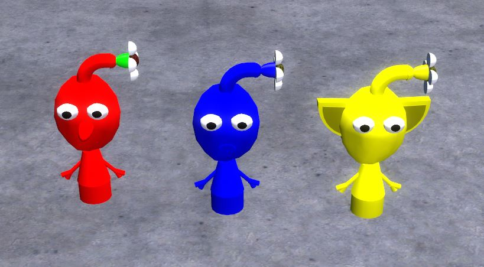

# Expression 2 - Pikmin E2

## Details

### Author

- Author: ChupachuGames (coolerthanu9)
- Steam Profile: https://steamcommunity.com/profiles/76561198023815430
- Reddit: https://www.reddit.com/user/ChupachuGames/
- YouTube: https://www.youtube.com/user/coolerthanu9
- YouTube: https://www.youtube.com/channel/UCc_t13NWt4gX0jrIeW16_fg

### Publication Info

- Title: Pikmin E2
- Date (dd-mm-yyyy): 21-07-2013
- Source: https://web.archive.org/web/20150304043548/http://www.wiremod.com:80/forum/finished-contraptions/32008-pikmin-e2.html
- Source Accessed (dd-mm-yyyy): 10-08-2025

## Description

Ever used the Pikmin mod before? That's essentially what this is, but all it requires is SProps, working holos, and obviously wiremod.(pikmin mod for death sound.) The holo pikmin will follow you anywhere you go, but they cannot follow you if you noclip, jump, or go through water. The pikmin can also drown and burn, so be careful!  
The way you make them follow you properly is by spawning the yellow, blue, then red, and wiring Pikmin to E to mark who follows who. Yellow, being the leader, does not need to be wired, for he is at the front, following you. Right clicking will cause the Pikmin to rush at the nearest player you look at. If you crouch and right click, they will go to your cursor. Don't use the CTRL-M2 to cheat the disband feature because that defeats the purpose of it being in there.  
I am still majorly working on this chip, but here's a little demo until I finish. Each Pikmin runs about 500 ops, so be careful...

### Known Bugs

- [Less Common]Pikmin wildly spaz out - grab them and push them back a few feet with the Physgun
- [FIXED]Pikmin spawn messed up - rotate them to a certain angle (X I think...) and re-paste the chip
- [FIXED]Pikmin fly away when spawned - be sure to wire them to the Pikmin for them to follow

Soon, I'll release a dupe so you will only need to paste at original angles. :3

Last edited by coolerthanu9; 07-24-2013 at 11:44 AM. Reason: bug fixes/e2 update

### Comment by ]Comrade Rassatana

**]Comrade Rassatana:**  
findExcludePlayer("Chupachu") wat

**coolerthanu9:**  
That prevents the Pikmin from attacking me. Just change it to your name.
