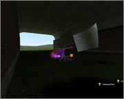
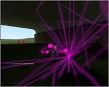
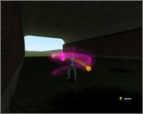
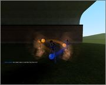
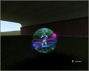
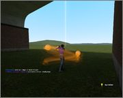
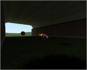
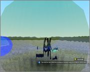
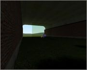
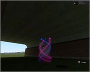

# Expression 2 - [e2][dota2]fully functional invoker orbs![propcore]

## Details

### Author

- Author: gishygleb

### Publication Info

- Title: [e2][dota2]fully functional invoker orbs![propcore]
- Date (dd-mm-yyyy): 03-09-2014
- Source: https://web.archive.org/web/20150429004628/http://www.wiremod.com/forum/finished-contraptions/33511-e2-dota2-fully-functional-invoker-orbs-propcore.html
- Source Accessed (dd-mm-yyyy): 10-08-2025

## Description

With these you may invoke 10 spells! Though, due to the lacking of E2 functionality they not fully resemble the original spells.

```plaintext
1. Deafening Blast.
2. EMP.
3. Alacrity.
4. Forge Spirit.
5. Ghost Walk.
6. Sun Strike.
7. Chaos Meteor.
8. Cold Snap.
9. Ice Wall.
10. Tornado.
```

### Controls

**To change orbs, press:**  
KeyUse for Quas, KeyReload for Wex, KeyZoom for Exort.

To invoke AND use the spell press MouseRightButton.
To use Attack (magic blast), press MouseLeftButton.

### Orb combination invocation

```plaintext
QQQ - Cold Snap, encase the AimEntity in an ice sphere for some time.
QQW - Ghost Walk, a protective shell around you.
QWW - Tornado, uplifts at the set position, SPAWN AT THE GROUND.
WWW - EMP, an overwhelming explosion after some time.
WWE - Alacrity, makes your Attack twice as quick.
WEE - Chaos Meteor, spawns a huge sphere over your head, which accelerates in a set direction.
EEE - Sun Strike, launches an explosive from the sky at a set point, imitating a beam of sun.
QEE - Forge Spirit, creates two spirit models near you, which launch magic blasts at the AimPos.
QQE - Ice Wall, spawns a wall in front of you.
QWE - Deafening Blast, spawns a quick moving prop in front of you.
```

### Images

1. Deafening Blast.  


2. EMP.  


3. Alacrity.  


4. Forge Spirit.  


5. Ghost Walk.  


6. Sun Strike.  


7. Chaos Meteor.  


8. Cold Snap.  


9. Ice Wall.  


10. Tornado.  

