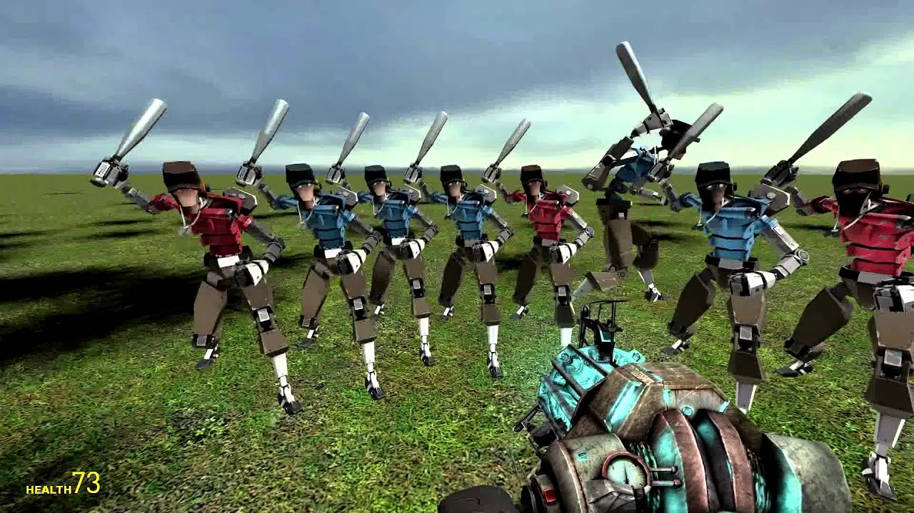
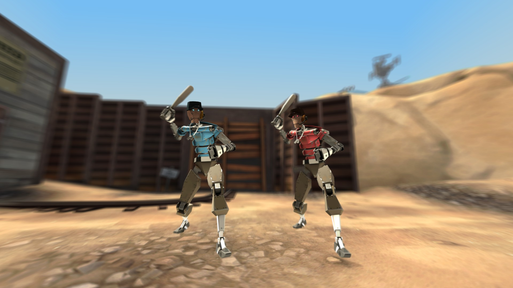

# Expression 2 - [E2] Following Scout Bot

## Details

### Author

- Author: Chaquator (Sly Fox)
- Github: https://github.com/chaquator
- Steam Profile: https://steamcommunity.com/profiles/76561198025785592
- YouTube: https://www.youtube.com/@chaquator

### Publication Info

- Title: [E2] Following Scout Bot
- Date (dd-mm-yyyy): 18-07-2014
- Source: https://web.archive.org/web/20150311071840/http://www.wiremod.com:80/forum/finished-contraptions/33315-e2-following-scout-bot.html
- Source: https://www.youtube.com/watch?v=ZfhnZ_yIG_M
- Source: https://www.youtube.com/watch?v=Y81GzgBuWxU
- Source Accessed (dd-mm-yyyy): 10-08-2025

## Description

I made a Scout Bot that follows you.
If you know how to E2, you can change the code up to have your own follower, or even a different target. The choice is yours!

Here is the video I made with this bot:
[YouTube - New York Offers Verbal Abuse](https://www.youtube.com/watch?v=ZfhnZ_yIG_M)

And a video I made with a scout bot I made long ago:
[Following MVM Scout Bot](https://www.youtube.com/watch?v=Y81GzgBuWxU)

