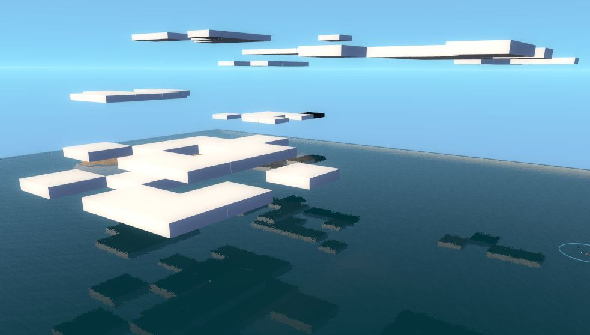
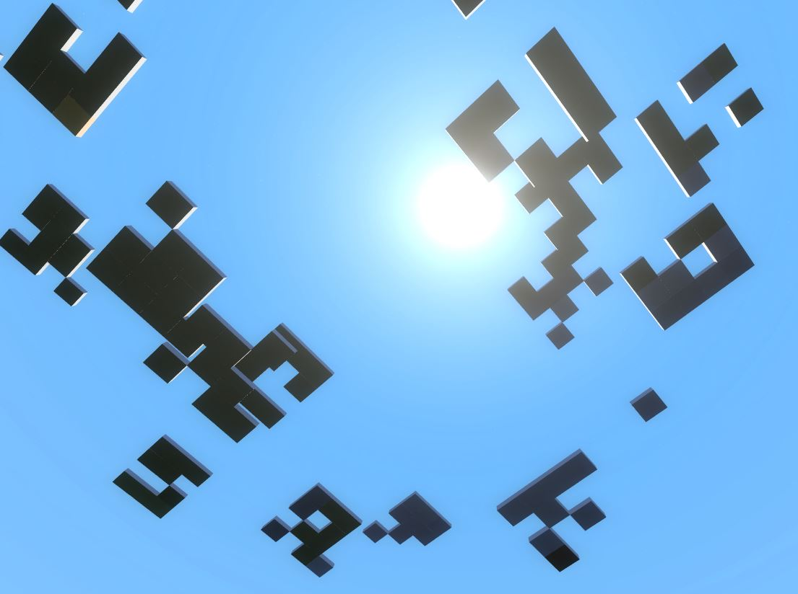

# Expression 2 - Clouds!

## Details

### Author

- Author: Natronblood

### Publication Info

- Title: Clouds!
- Date (dd-mm-yyyy): 03-07-2010 
- Source: https://web.archive.org/web/20100709174611/http://www.wiremod.com:80/forum/finished-contraptions/21125-clouds.html
- Source Accessed (dd-mm-yyyy): 11-08-2025

## Description

### Clouds Beta

Clouds attempts to replicate clouds from Minecraft. However it is incomplete.

### Features

- Randomly generated clouds (Needs better algorithm)
- Moving clouds!
- Cloud looping (Once the cloud exit the maps, it starts again at the other end of the map)

### Following options you'll see

1) GridBase: Size of clouds.
2) Height: How high the sky will be, leave 0 if unsure.
3) CloudsCount: Amount of clouds.

