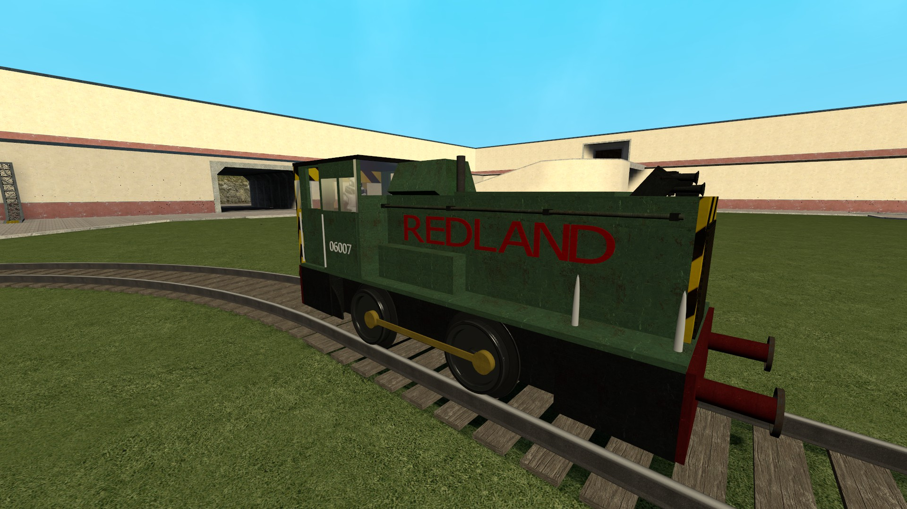

# Expression 2 - Holo Sprops Text

## Details

### Author

- Author: Tolyzor
- Steam Profile: https://steamcommunity.com/profiles/76561197980070446
- YouTube: https://www.youtube.com/user/Heatseeker1
- Github: https://github.com/Tolyzor

### Publication Info

- Title: Holo Sprops Text
- Date (dd-mm-yyyy): 06-09-2014
- Source: https://web.archive.org/web/20160422094157/http://www.wiremod.com/forum/finished-contraptions/33516-holo-sprops-text.html
- Source Accessed (dd-mm-yyyy): 11-08-2025

## Description

This allows you to parent 3d text to any entity (such as a vehicle), but more importantly, you can create and edit the text in seconds!

### Instructions

1. Type in the text you want, and its properties to the "text attributes" section of the code.
2. Wire E:entity to the entity you want to parent to, and the rest of the inputs to a laser pointer receiver.
3. Use the laser pointer to position your text.
4. When you are happy with your text you can remove the laser pointer receiver and dupe the e2.
