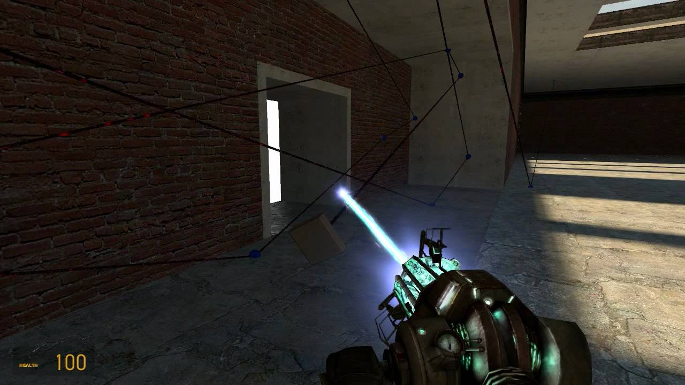

# Expression 2 - RealTime Laser

## Details

### Author

- Author: Hitman271 (radixdev)
- YouTube: https://www.youtube.com/@Hitman271

### Publication Info

- Title: RealTime Laser
- Date (dd-mm-yyyy): 10-08-2009
- Source: https://web.archive.org/web/20090814200106/https://wiremod.com/forum/contraptions-saves/13108-realtime-laser.html#post125606
- Source: https://www.youtube.com/watch?v=uvj30msdHnk
- Source Accessed (dd-mm-yyyy): 02-09-2025

## Description

This is a laser that is coded entirely in Expression 2, and this laser displays every beam and point and updates each in realtime.

The laser in the video is displaying 15 points 40 times a second for about 55% of the total quota. This means that about 30-60 points( tested) can be achieved with a much slower interval.

The lone chat command not seen in the video is the "lasor.active X" command. Any number greater or equal to 1 will set the laser active. Any number less than 1 will deactivate the laser, but the beams and points will still display.

The parameters for the code include: Number of points, draw distance, and the interval update time. These are all edited in the code to give examples of how to use them.

Video:  
[YouTube - RealTime Laser Eg2 - HD Video](https://www.youtube.com/watch?v=uvj30msdHnk)

This code was made in Notepad ++ so you might have to edit it in that

Post for suggestions, questions, usage( free to edit/use ), whatever.

Thanks to Madjawa, Chinoto, and D3C for coding help.
