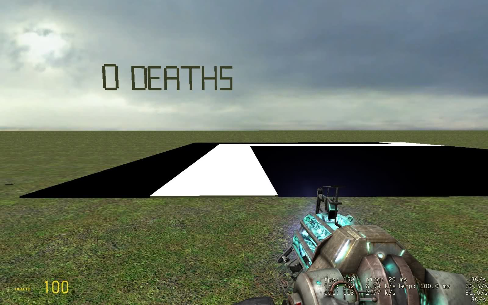
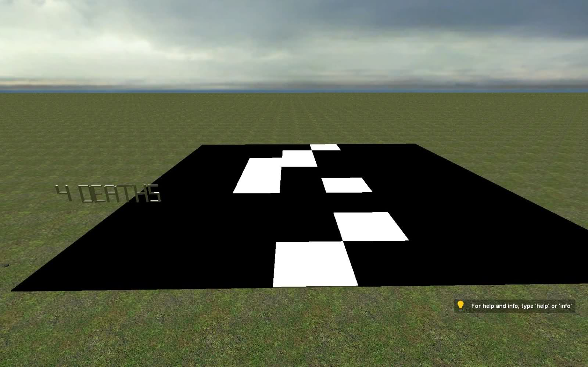
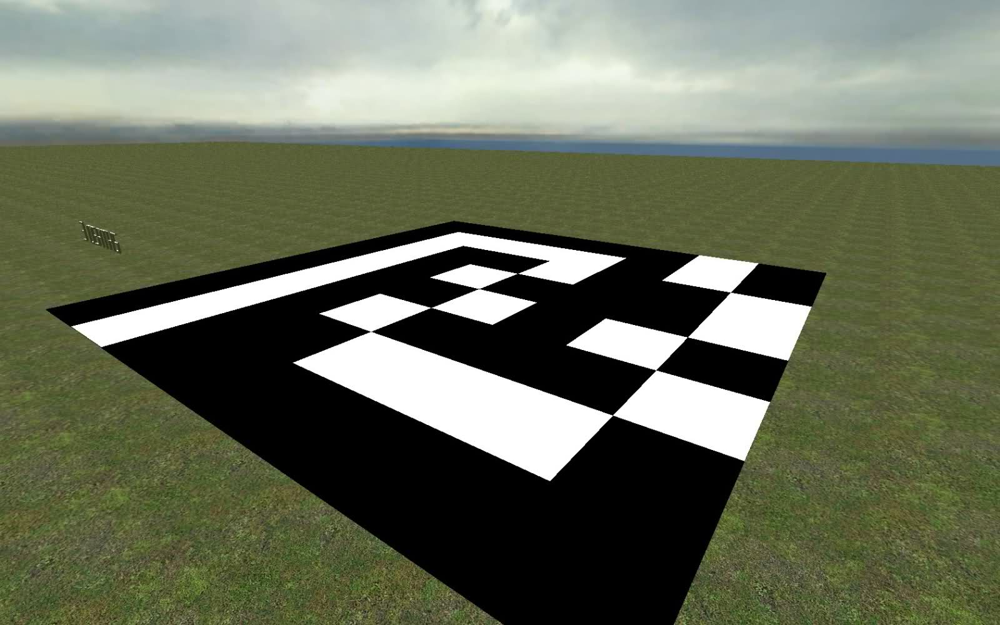
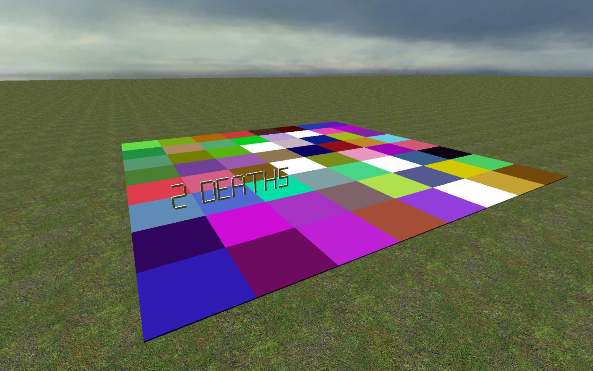

# Expression 2 - [WIP] [E2] Holo maze-like game

## Details

### Author

- Author: Zero

### Publication Info

- Title: [WIP] [E2] Holo maze-like game
- Date (dd-mm-yyyy): 19-04-2012
- Source: https://web.archive.org/web/20120426124205/http://www.wiremod.com/forum/finished-contraptions/29336-wip-e2-holo-maze-like-game.html#post260392
- Source Accessed (dd-mm-yyyy): 10-08-2025

## Description

Hey guys, heres something I've been working on. Pretty much finished everything just gotta add some different maps and tiles.

This is basically a maze-like game using holos. You must walk along the "safe" path to get to the otherside.

Try it out! Simply spawn the expression near the center of the map (a flat map will work best).

Type "`help`" for instructions.

I would love to hear your constructive criticism and if you find any problems or bugs, please post!  
Thanks, hope you enjoy.

Screenies:  

  
  
   
  
  

<!--

-->
