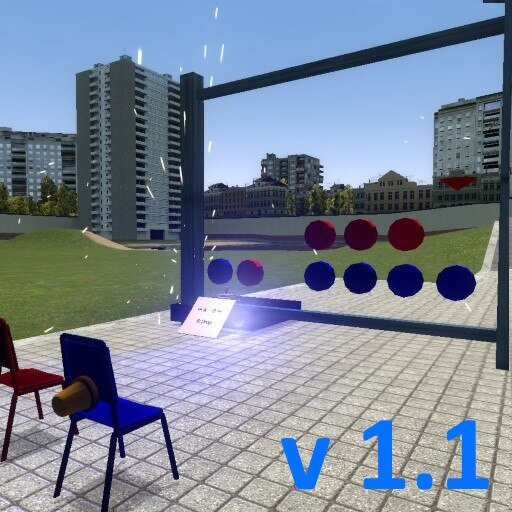

# Expression 2 - Connect 4th game [Wiremod]

## Details

### Author

- Author: Kolore!
- Steam Profile: https://steamcommunity.com/profiles/76561197962439816

### Publication Info

- Title: Connect 4th game [Wiremod]
- Date (dd-mm-yyyy): 13-12-2022
- Edited Date (dd-mm-yyyy): 24-08-2024
- Source: https://steamcommunity.com/sharedfiles/filedetails/?id=2901286191
- Source Accessed (dd-mm-yyyy): 19-08-2025

## Description

> [!Note]
> This expression 2 is extracted from a dupe.  
> Check the "dupes" folder if you want the whole contraption.

  

<!--

-->

Classic connect 4 game  
2 players game  
To be found in "Dupes" Section

1- Turn on the dupe, Have a seat  
2- A, D: move the cursor  
3- S: drop the token

Remove the message, if you're able to do so.
Unfreeze things with physgun

- uses wiremod chips
- if you wish to edit , call me! I can help!
- have saurian games !! :roar:

---

### thanks to

- player feedbacks on Metastruct, I just wanna Build.
- Friends who tried it without knowing what to do
- discord wiremod
- a real daredevil player I've met on metastruct

### Last update

- Removed the on\off button - the reset button works for activating and resetting the game
- Reset button won't work when two players are seated (when a match is running)
- Changed the graphic color of the board to reflect the new changes
