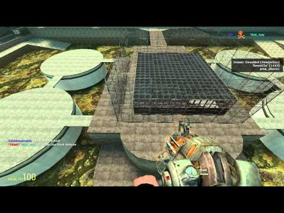

# Expression 2 - [E2]Instant Base That Regenerates

## Details

### Author

- Author: XninjazXxx (gato) (Devoided) (Azule)
- Steam Profile: https://steamcommunity.com/profiles/76561198054661508
- YouTube: https://www.youtube.com/channel/UC-6WOjHUNpGwkk3fVCfrhGQ

### Publication Info

- Title: [E2]Instant Base That Regenerates
- Date (dd-mm-yyyy): 24-08-2014
- Source: https://web.archive.org/web/20150429084844/http://www.wiremod.com/forum/finished-contraptions/33486-e2-instant-base-regenerates.html
- Source: https://gist.githubusercontent.com/anonymous/1f5b3fe88f417c981e4b/raw/3cacaf4c447abf216194c4b06b9c22521eb3e815/aaaa
- Source: https://gist.githubusercontent.com/anonymous/80f3bfc39370dbd6c887/raw/874c645c54ecbb588b807d3a092fa1bb5fe441c2/bunker2.txt
- Source Accessed (dd-mm-yyyy): 22-08-2025

## Description



This expression 2 is actually my old E2 modded so the coding quality is pretty messy.

### How to use

- Installing: You save the instant base e2 and put the bunker.txt file into your e2shared folder.
- Using: Hold down attack2 and press E to spawn the base/bunker/what ever you want to call it and then wait for it to spawn. Type `/remove` to remove it, `/off` to turn it off, `/exclude:[name]` (note that you need the colon and that it only works when turned off) to let people inside your base w/o killing them, `/clear` to clear all white-listed people on the list, and `/on` to turn back on.
- Using the bunker saver: go inside a building at the very bottom floor in the middle and type `/save [name]`. Type `/load [name]` to load that file. If the building is too big then type `/radius [number (default is 200)]` to change the save radius. Type `/angle [vector]` to change loading the angle, type `/offset [vector]` to change the offset, and finally type `/freezeall` to freeze all spawned props.

### Instant Base

#### COMMANDS

```plaintext
/off - turns base off
/on - turns base on
/owner [name] - gives co-ownership of the E2 to someone (put your name in name space if you want to keep to self)
/exclude:[name] - excludes a person from kill aura(Requires killing to be off).
/stopkill - stop killing people near
/stopregen - stops regenerating base
/filename [file name] - changes the file to be used as base
/radius [number] - changes kill radius (PM me if abused and I'll remove/restrict it.)
/remove - removes base and resets chip
/clear - clears all people excluded from kill aura except for you
```

### Bunker Saver

<!-- #### Video:

https://web.archive.org/web/20170104233012/https://www.youtube.com/watch?v=cat78XP_h9k -->

#### Saved bunker samples

[First bunker](https://gist.githubusercontent.com/anonymous/1f5b3fe88f417c981e4b/raw/3cacaf4c447abf216194c4b06b9c22521eb3e815/aaaa)  
[Second Bunker](https://gist.githubusercontent.com/anonymous/80f3bfc39370dbd6c887/raw/874c645c54ecbb588b807d3a092fa1bb5fe441c2/bunker2.txt)

The bunker saver is intended for single player as you can change the hard quota with `wire_expression2_quotahard 10000000`, `wire_expression2_unlimited 1` also helps and `wire_expression2_quotatick 10000000`.
