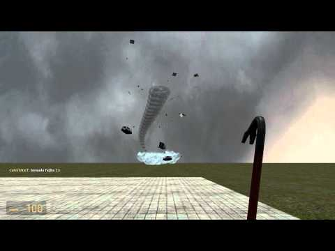

# Expression 2 - A Cubical Tornado

## Details

### Author

- Author: Hitman271 (radixdev)
- YouTube: https://www.youtube.com/@Hitman271

### Publication Info

- Title: A Cubical Tornado
- Date (dd-mm-yyyy): 10-08-2010
- Source: https://www.youtube.com/watch?v=9eCnhv9lj6o
- Source: https://gmods.org/view/6754
- Source Accessed (dd-mm-yyyy): 25-09-2025

## Description

> [!Note]
> Missing E2: Tornado Physics (tornado_physics.txt)  
> Tornado Vortex E2 is only for visual

Video:  
https://www.youtube.com/watch?v=9eCnhv9lj6o

E2 tornado and a cube. The cube only follows a player when they aren't looking. The tornado can handle up to 212 objects.
