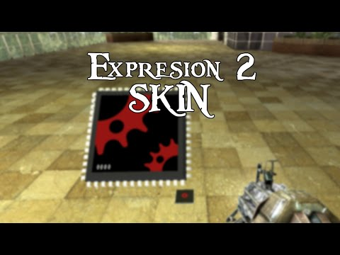

# Expression 2 - e2 skin

## Details

### Author

- Author: FailCake
- YouTube: https://www.youtube.com/@edunad
- Steam Profile: https://steamcommunity.com/profiles/76561198001836909
- Github: https://github.com/edunad

### Publication Info

- Title: [E2] FailCake's Gautlier
- Date (dd-mm-yyyy): 07-12-2014
- Source: https://web.archive.org/web/20150429005333/http://www.wiremod.com/forum/finished-contraptions/33763-e2-failcakes-gautlier.html
- Source: https://www.youtube.com/watch?v=UO9kZZM7IWM
- Source Accessed (dd-mm-yyyy): 18-08-2025

## Description

Hai! Hai!
Been a while since i posted something here, so here i go.  
I've been working on a "minigame" e2 based on playrz gautlier.

Here is how it looks so far:  
[YouTube - [GMOD][E2] FailCake's Gautlier - Showcase](https://www.youtube.com/watch?v=jejcrfxP_BE)

Also i made a design for my e2s (like a skin), i really think it  
would look good on the actual e2 :<

Here is it :  
[YouTube - [GMOD][E2] Skin - By Me!](https://www.youtube.com/watch?v=UO9kZZM7IWM)

### Commented by Thal Verscholen

not posting the code of the e2 skin  
FailCake_e2_skin.txt
