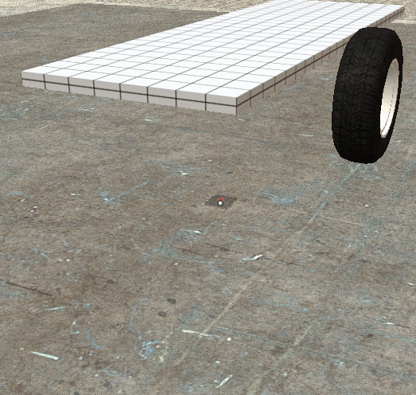

# Expression 2 - Easy Suspension E2

## Details

### Author

- Author: clock (ClockEFFX)
- Steam Profile: https://steamcommunity.com/profiles/76561198029798501

### Publication Info

- Title: Easy Suspension E2
- Date (dd-mm-yyyy): 06-12-2023
- Source: Armored Combat Framework Discord: community-resources
- Source Accessed (dd-mm-yyyy): 09-09-2025

## Description

Made a auto suspension e2 because i didnt want to manually do suspension on 14 tank wheels.  
Maybe someone else will find this useful.

### Instructions

there are hints printed to chat, but heres some instructions anyway (caps are important)

```plaintext
step 1, place the e2
step 2, press E on the FRONT/BACK of your baseplate
step 3, press E on the OUTWARDS-SIDE of your wheel
step 4, press E on the ballsocket target (either your baseplate or your setang)
step 5, press E to confirm placing ropes
step 6, press E to confirm placing the hydraulics
step 7, done - the e2 will auto remove itself
```

### Some notes

You can press R on some steps to skip parts of the e2, say if you only want to place ballsockets, you can press R on the rope and hydraulic step to skip them.  
It should work with any direction, but facing north gives best results
the ballsockets are "special" and have less wobble than doing them manually (in my experience)



### Requirements

- Requires Propcore
