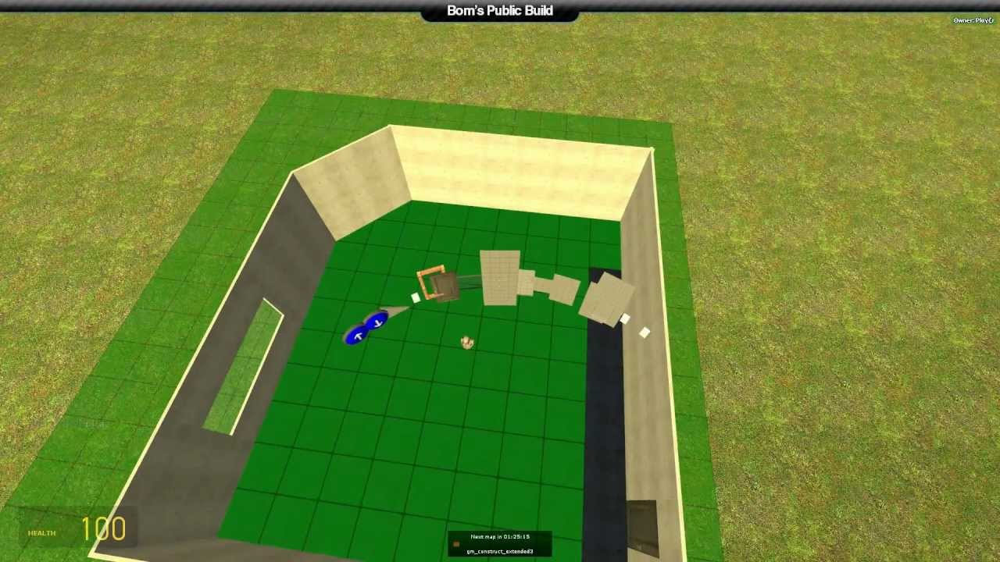

# Expression 2 - Playzr's Housebuild E2 V.1.1 for Garry's Mod

## Details

### Author

- Author: Playzr
- Steam Profile: https://steamcommunity.com/profiles/76561197973672474
- YouTube: https://www.youtube.com/@PlayzrUK

### Publication Info

- Title: Playzr's Housebuild E2 V.1.1 for Garry's Mod
- Date (dd-mm-yyyy): 04-04-2019
- Source: https://steamcommunity.com/sharedfiles/filedetails/?id=130058370
- Source: https://pastebin.com/UKuHeyyc
- Source: https://www.youtube.com/watch?v=dn1uvH_prfA
- Source Accessed (dd-mm-yyyy): 26-08-2025

## Playzr's Housebuild E2 V.1.1 for Garry's Mod

An E2 I made in Garry's Mod that lets you build houses like in the popular game The Sims. It uses Expression Gate 2 and PropCore functions.

Updated:
6 years later, here's the 'fixed' E2 code: [https://pastebin.com/UKuHeyyc](https://pastebin.com/UKuHeyyc)

It's the same code just with the glonEncode and glonDecode changed to vonEncode and vonDecode. As for missing textures, this still works fine for me when I test it on a multiplayer server. I'm delighted some people still think this old E2 is pretty cool.

