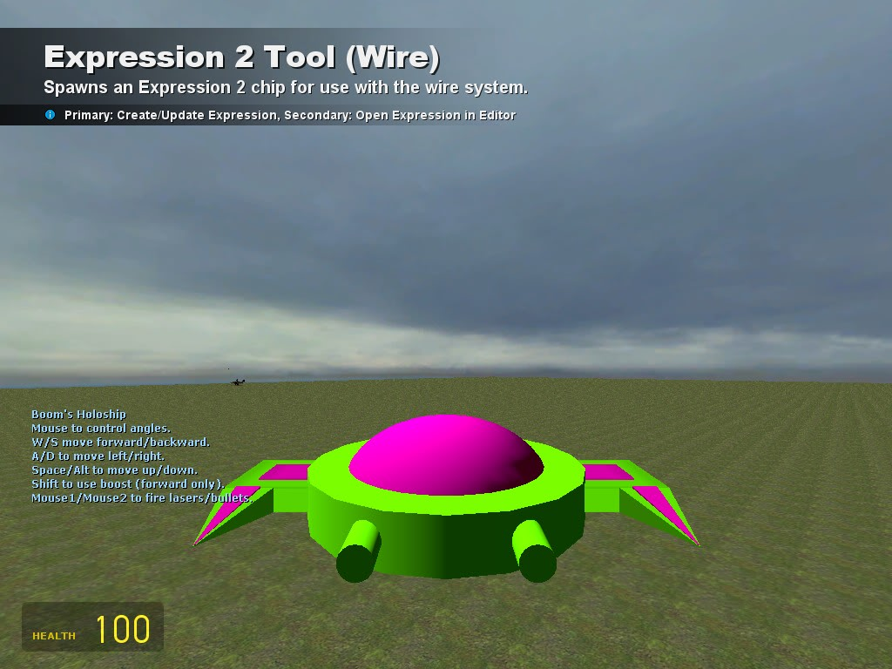

# Expression 2 - Boom's HoloShip

## Details

### Author

- Author: Boom

### Publication Info

- Title: A few of my E2s
- Date (dd-mm-yyyy): 22-08-2010
- Source: https://web.archive.org/web/20150306042629/http://www.wiremod.com:80/forum/finished-contraptions/22176-few-my-e2s.html
- Source Accessed (dd-mm-yyyy): 02-09-2025

## Description

> [!Note]
> Part of a pack

First I have my Holo Ship

### Edits to the Holoship

1. Added holo bullets.
2. Removed chat commands.
3. Lasers are now an electric material.
4. Random COOL color each spawn.

### Known Bugs

1. If you press two keys that both play a sound, the sound will shut off.
2. If you spam bullets the bullet sound will shut off for a couple seconds. I tried to fix that by putting a one second delay into shooting the bullets.

### Controls

1. Mouse controls angles (Mouse Aimed)
2. WSAD (Self Explanatory)
3. Space/Alt (Up/Down)
4. Shift uses boost (Forward Only)
5. Mouse1/Mouse2 (Shoots Lasers/Bullets)

