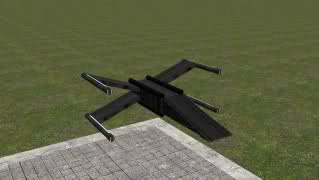
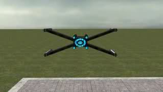
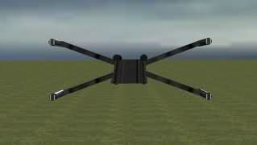

# Expression 2 - Hologram Dogfighter

## Details

### Author

- Author: darksie

### Publication Info

- Title: Hologram Dogfighter
- Date (dd-mm-yyyy): 23-01-2010
- Source: https://web.archive.org/web/20110220205320/http://www.wiremod.com:80/forum/finished-contraptions/17570-hologram-dogfighter.html
- Source Accessed (dd-mm-yyyy): 11-08-2025

## Description

Hey guys, finally got round to making my first release.

It's a Holo mini flying spaceship Techni and a few of my friends inspired me to create my own version...it uses Applyforce to fly.

Just going to cover the controls and how to set it up...it requires Spacebuild2 Materials to see what it truly looks like.

### Controls

```plaintext
W = Forward
A = Strife Left
S = Backwards
D = Strife Right
Shift = Super Speed
Alt = Fly Down
Space = Fly Up
Mouse2 = Fly Slowly (the input name is called Rinput)
```

As for turning it's mouse controlled.

Everything else you should be able to do.

### Instructions

Now for putting it together..

Spawn a small plate, place a Adv pod controller on it and then a cam controller..

wire all of the above to the Adv pod..then Activated from the Cam to the pod on "active" and finally Position Vector / Direction Vector to the E2 Chip which is inside the hologram don't mind pos vector.

### Images

Heres some pictures.





### Credits & Feedback

Feel free to comment or critisize me :P  
Credit to BI0H@ZrD for his inspiration
