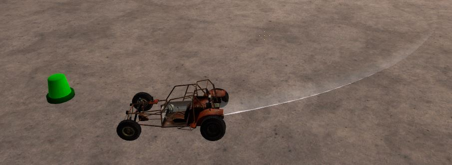

# Expression 2 - Mr. Keating's RC car - Public Release

## Details

### Author

- Author: KUKA

### Publication Info

- Title: Mr. Keating's RC car - Public Release
- Date (dd-mm-yyyy): 02-11-2019
- Source: Wiremod Discord: Contraptions Archived
- Source Accessed (dd-mm-yyyy): 03-09-2025

## Description



have a free RC car

```plaintext
It's Quick! It's Fast! It's Mr. Keating's Electric RC Car!
Public Release: Free distribution by any method.
Any changes will be posted on #script-share on the S37K Discord

Instructions:
    1. Spawn a Pod Controller in any location
    2. Wire Driver [ENTITY] to the same output of the pod controller.
    3. Apply "Super Ice" physical properties material to the E2
    4. Acquire wire weapon "Remote Control"
    5. Link the remote controller by pressing left mouse button
    6. Turn on pod controller by pressing E away from the pod controller
    7. Enjoy! Try changing the model and color to your liking.

TIP: If your E2 turns red, simply reload the E2.
```
