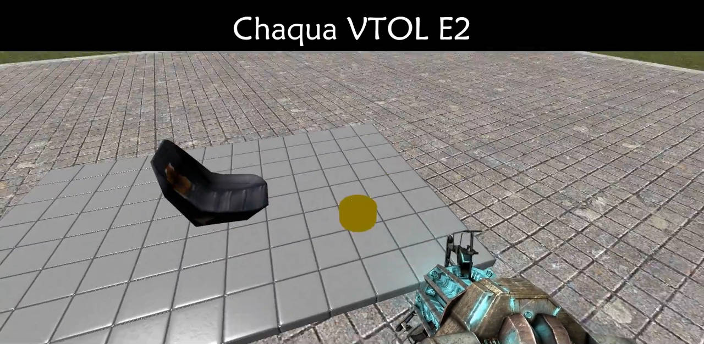

# Expression 2 - Chaqua VTOL E2

## Details

### Author

- Author: Chaquator (Sly Fox)
- Github: https://github.com/chaquator
- Steam Profile: https://steamcommunity.com/profiles/76561198025785592
- YouTube: https://www.youtube.com/@chaquator

### Publication Info

- Title: Chaqua VTOL E2
- Date (dd-mm-yyyy): 31-05-2014
- Source: https://web.archive.org/web/20150429033105/http://www.wiremod.com:80/forum/finished-contraptions/33113-chaqua-vtol-e2.html
- Source: https://www.youtube.com/watch?v=d7dlG0jICyM
- Source Accessed (dd-mm-yyyy): 26-08-2025

## Description



Saw some people flying on a server, felt bad since my recent flying E2s were too complex to be enjoyable, so I made this one.

### Instructions

It's easy to use.

All you do is spawn your base prop, parent (or even weld) your chair to the base, and spawn the E2 on it.

It's as simple as that.

### Controls

The controls are

```plaintext
• W & S - Control Pitch
• A & D - Control Roll
• M1 & M2 - Control Yaw
• Shift & Space - Control Throttle
```

### Video

[YouTube - Chaqua VTOL E2](https://www.youtube.com/watch?v=d7dlG0jICyM)

---

### BMA OR1G1NAL issue

**BMA OR1G1NAL:**  
Great work but you might have to fixur code it keeps on going up for me ?

**Chaquator:**  
Change FC to something lower than 9. This number is different for lots of servers.
