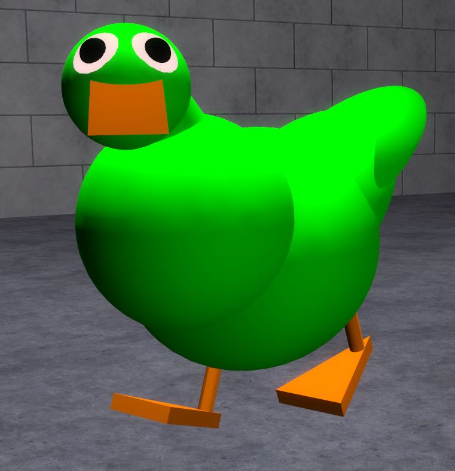

# Expression 2 - The Red Duck

## Details

### Author

- Author: \<Unknown Author\>

### Publisher

- Publisher: podie45
- Steam Profile: https://steamcommunity.com/profiles/76561198136318087

### Publication Info

- Title: DUCKY BEST FRIEND V 1.0 ( 5 YEARS OLD, V2.0 SOON! )
- Date (mm-yyyy): 01-08-2014
- Source: https://steamcommunity.com/sharedfiles/filedetails/?id=294243127
- Source Accessed (dd-mm-yyyy): 04-09-2025

## Description

> [!Note]
> This expression 2 is extracted from a dupe.  

  

<!--

-->

5 YRS ANNIVERSARY - I know this was published in 2014, but the duck who inspired the Ducky Best Friend V1.0 is now 5 Yrs old, so technically this version is also 5 yrs old. V 2.0 remaster is coming.

Heres Ducky, my best friend , you can ride him on the grass & water. Fly him around! Press MOUSE 1 to Quack it.

### Controls

CTRL : 3rd player
SPACE : Fly
MOUSE 1 : QUACK!
A,W,S,D : Move

### Commands

Chat command for ducky ( credit to cycle ) :

`.stay` - Tells the duck to stay in place.  
`.follow <name>` - Follows the player you specified. If given an invalid name it follows you.  
`.followme` - Follows you.

### Credits

I dont want all the credits, the first creator of ducky was ME TOOSTA: http://steamcommunity.com/profiles/76561198093932522

( first version ) link :

http://steamcommunity.com/sharedfiles/filedetails/?id=288583210&searchtext=duck
