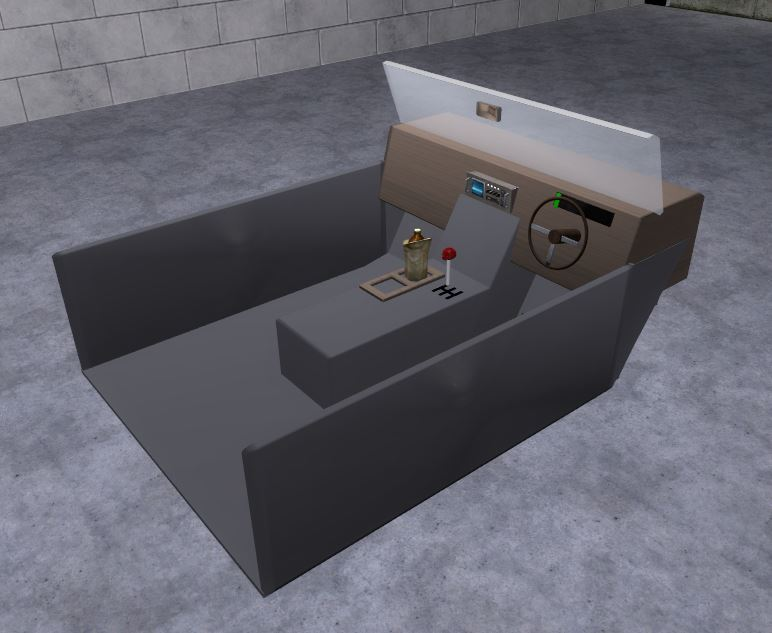

# Expression 2 - Hologram Dashboard

## Details

### Author

- Author: postman ([TBU-TEC] THE P)
- Steam Profile: https://steamcommunity.com/profiles/76561197997916844
- YouTube: https://www.youtube.com/@blankrofl

### Publication Info

- Title: [E2] Three of my best E2's release thread [STARGATE, HOLO DASHBOARD, POLTERGIEST]
- Date (dd-mm-yyyy): 07-11-2011
- Source: https://web.archive.org/web/20150330233825/http://www.wiremod.com:80/forum/finished-contraptions/27849-e2-three-my-best-e2s-release-thread-stargate-holo-dashboard-poltergiest.html
- Source Accessed (dd-mm-yyyy): 30-08-2025

## Description

> [!Note]
> Part of a pack

Now i decided to release a bunch more e2's today, I just finished the "AI release thread (check sig), and now i have 3 more e2's

Really these e2's deserve their own threads, but i didnt think posting 4 separate threads would be a great idea.

Im going to split this into 3 sections, each E2 will have instructions, description, code, and pictures.

---

### *Hologram Dashboard*

  

<!--

-->

### Description

this is a dashboard, made out of holograms, it is designed to take data inputs, and display them in the form of a dash. It is not meant to control the vehicle in any way. I made this specifically using my crawler, of which the e2 engine has gears, 8 of them (-2,-1,0,1,2,3,4,5).

Making this was a blast, and also quite difficult, over the period of about 2 weeks. It has a gear shift, a working gas, brake, and clutch pedal, a speedometer percent bar, a working steering wheel, the ability to be right OR wrong(left) side driven. A rear view mirror, and last but not least, a beer.

### Instructions

1. Wire the WL:wirelink output to your pod controller, and reweld your seat (or place it) in the correct position.  
2. Wire the SteeringPlate:entity output to your steering plate/steering bar, the dash will pull angles from this and display it by turning the wheel (it has a bug while going reverse and steering, not enough of a problem to fix)  
3. Next IF you have an engine that has gears, OR some way to define the gears, wire the "GEAR" output to that.  
IF you do NOT have a way to get the gears, the e2 will base the gears on your speed, the system does not work great, but it does still work correctly.  
4. Finally, drive your car around :p

<!-- ### Pictures:

*mind the lower resolution, i made it lower so i could still use the task bar* -->

---

### *Thus concludes*

Enjoy these chips, i sure did, and it was quite fun putting them together, dont put them elsewhere.
