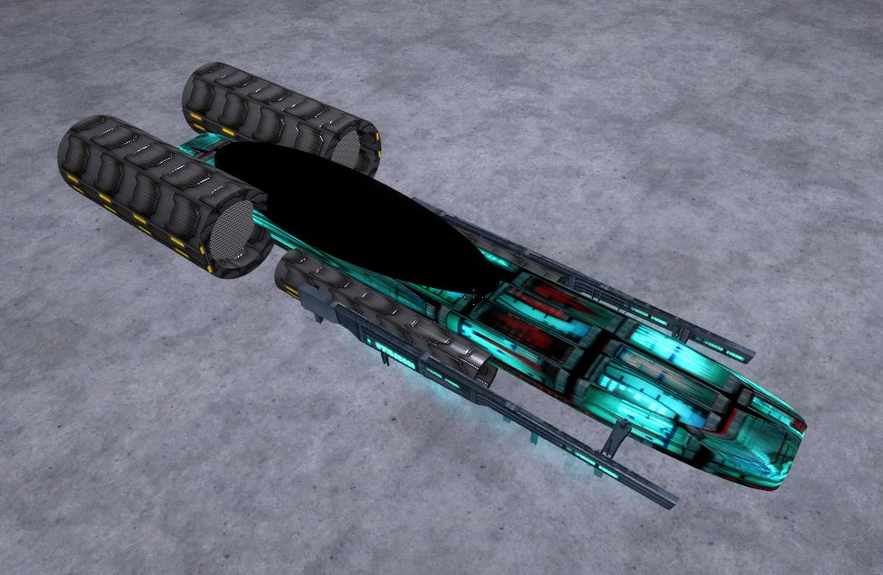

# Expression 2 - Raveos Instant Hover Car

## Details

### Author

- Author: Raveo (Chey)

### Publication Info

- Title: Raveos Instant Hover Car
- Date (mm-yyyy): 19-12-2013
- Source: https://web.archive.org/web/20150304055733/http://www.wiremod.com:80/forum/finished-contraptions/32513-raveos-instant-hover-car.html
- Source Accessed (dd-mm-yyyy): 04-09-2025

## Description

I try and make my chips as easy to use as possible.  
Here are some simple steps to use:

1. Spawn a prop in to place the E2 onto (1x1 plate works best)

2. Spawn the E2 on top of the prop.

3. Place a chair down anywhere on the prop (once the chip detects a chair nearby it will automatically link it)

4. Enjoy!

Edit 1: Added trails  
Edit 2: No longer will get stuck on walls, now it will either stop or explode.

