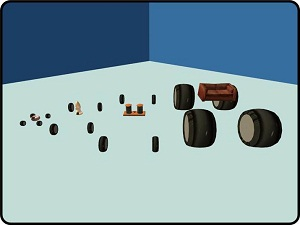

# Expression 2 - [E2] Instant Chassis V2

## Details

### Author

- Author: Cipher_Ultra
- YouTube: https://www.youtube.com/user/CipherUltra
- Steam Profile: https://steamcommunity.com/profiles/76561197978513282

### Publication Info

- Title: [E2] Instant Chassis - Steering and Suspension
- Date (mm-yyyy): 21-01-2011
- Source: https://web.archive.org/web/20150716034205/http://www.wiremod.com:80/forum/finished-contraptions/28138-e2-instant-chassis-v2.html
- Source: https://web.archive.org/web/20160504052312/http://www.wiremod.com:80/forum/finished-contraptions/24483-e2-instant-chassis-steering-suspension.html
- Source: Meta Construct, advanced duplicator 1: public folder
- Source Accessed (dd-mm-yyyy): 22-08-2025

## Description

An E2 that allows users of any skill level to have an instant steering, suspension and transmission system.



\- Image of V1, but V2 basically looks the same.

You can place this on effectively any prop. I recommend building your vehicle similar to the example dupe I have included. i.e. 1 'base' prop and 1 or more weighted 'collison box' props or bumpers.

### Features

Features whole new code for all parts, including customisable:

```plaintext
Suspension height
Wheel position
Wheel size
Wheel grip
Front or Rear wheel drive or steer
Gearbox type (Manual, Auto, CVT-Auto)
Engine sounds (I recommend you download Karbine's Sound Pack! )
3rd person camera
and more!
```

### Instructions

```plaintext
Wire(link) an adv pod controller to it and you have an instant car!
Gas = W
Brake = S
Steer = A/D
Gear Up = Shift
Gear Down = Alt
```

Gearboxes are 5 speed.
Auto box order is: Park > Reverse > Neutral > Drive

### Final Note

I am releasing because alot of people have been asking me for this for ages. There are still a few bugs and I'm working on improving realism and reducing ops. Please post if you have any comments/ideas.

If you use any of this code for a contraption that you release, please credit me.
