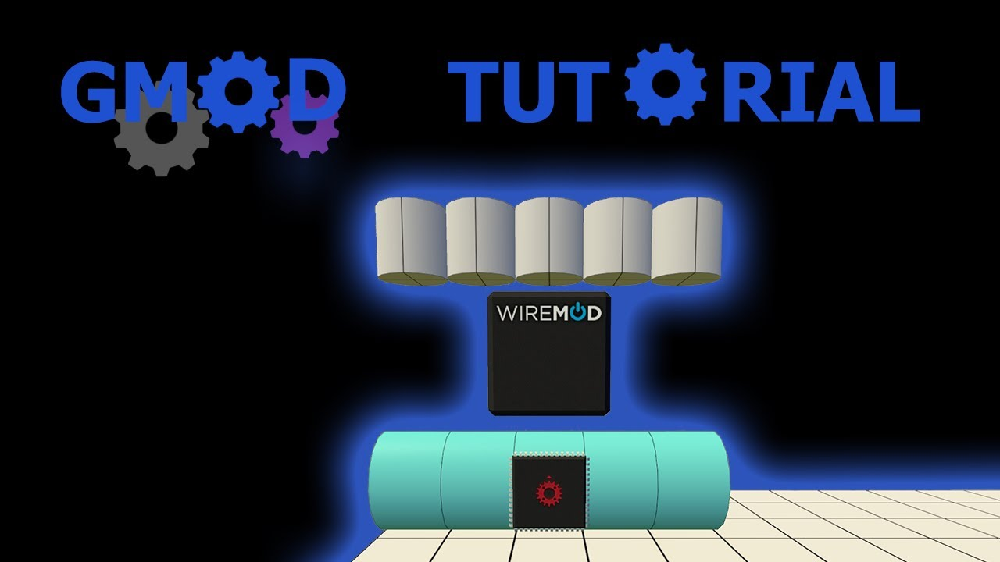

# Expression 2 - Gmod - Engine Tutorial (Updated)

## Details

### Author

- Author: RCmags (XXXmags)
- Steam Profile: https://steamcommunity.com/profiles/76561197991496783
- YouTube: https://www.youtube.com/@XXXmags
- Github: https://github.com/RCmags

### Edited

- Edited: Spider0804
- Steam Profile: https://steamcommunity.com/profiles/76561197996888024
- YouTube: https://www.youtube.com/user/spider0804
- Pastebin: https://pastebin.com/u/Spider0804

### Edited 2

- Edited: Christian

### Publication Info

- Title: Gmod - Engine Tutorial (Updated)
- Date (dd-mm-yyyy): 27-12-2013
- Source: https://www.youtube.com/watch?v=NlXkmK3DPvM
- Source: https://pastebin.com/WhVgueXW
- Source Accessed (dd-mm-yyyy): 22-08-2025

## Description

Here is a new engine tutorial that is updated with what I have learned since the last one.

Made by xxxmags, Improved by Spider0804 & Christian

**Video:** [YouTube - Gmod - Engine Tutorial (Updated)](https://www.youtube.com/watch?v=NlXkmK3DPvM)  
**Pastebin:** https://pastebin.com/WhVgueXW
