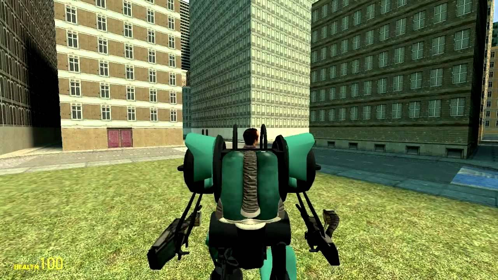

# Expression 2 - exoskeleton / mechsuit

## Details

### Author

- Author: STALKER (Danger_Calzone_) (CleverCabbage)
- Steam Profile: http://steamcommunity.com/profiles/76561197998945516
- YouTube: https://www.youtube.com/@stalker2602
- Pastebin: https://pastebin.com/u/Stalker260

### Publication Info

- Title: GMOD: exoskeleton / mechsuit
- Date (dd-mm-yyyy): 01-01-2014
- Source: https://www.youtube.com/watch?v=HIF55g4cmRw
- Source Accessed (dd-mm-yyyy): 18-08-2026

## Description

My first (proper) attempt at a mech e2. Features flight, strafing and weaponry-control. The e2 can be used with a body consisting of normal props, but it also features a holographic skeleton which allows for a fully holographic body. The e2 runs at a maximum of approximately 620-ish ops, and is very easy on servers due to the lack of constraints and complicated applyforce / applytorque.
