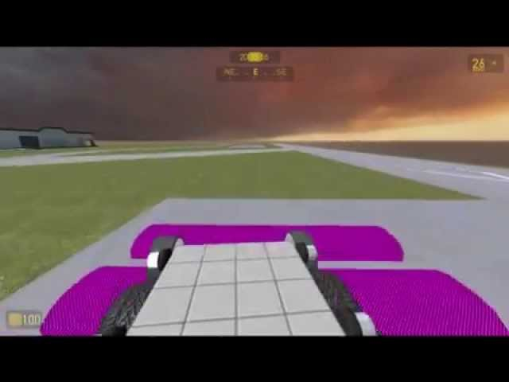

# Expression 2 - Hydraulic active suspension

## Details

### Author

- Author: RedReaper (redreaper2020)
- YouTube: https://www.youtube.com/@redreaper-xe6so

### Publication Info

- Title: Hydraulic active suspension
- Date (dd-mm-yyyy): 23-04-2011
- Source: https://www.youtube.com/watch?v=zve8d-UtNfA
- Source Accessed (dd-mm-yyyy): 30-08-2025

## Description

Video: [YouTube - Hydraulic active suspension - Release!](https://www.youtube.com/watch?v=zve8d-UtNfA)

Weld E2 to the base upright, the little arrow on the E2 facing forward, then arm e2 and press reload to reinitialize the E2.  Put hydraulics like in video.  `LA` = front left, `LB` = second one on left, `RE` = last one on right, etc...dance all night.
