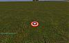
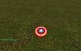
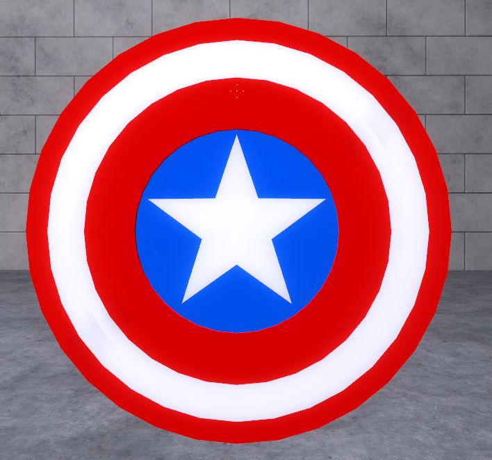

# Expression 2 - [E2] Captain America Shield

## Details

### Author

- Author: Pixelazed

### Publication Info

- Title: [E2] Captain America Shield
- Date (dd-mm-yyyy): 01-05-2014
- Source: https://web.archive.org/web/20160606103418/http://www.wiremod.com:80/forum/finished-contraptions/32999-e2-captain-america-shield.html
- Source Accessed (dd-mm-yyyy): 26-08-2025

## Description

Soo i made this today when i got bored.
its basicly a shield that floats in front of you (Doesnt really protect you as the e2 model is pretty small) <- ill fix that later
and when you press mouse 2 you throw the shield in the direction you aim. (if you hold it it throws it further)

you need sprops to see the shield and modelany needs to be on

### Screens (Sorry no action shots)

### Edit

so now the whole thing is solid (well just the e2 model is bigger still uses holos), and it can actually protect you... not sure from what belly shots maybe? tanks driving into you? well idk.
another thing, i tried making it come back more realiticly, when you throw it like at a angle it comes back like a boomerang and well... can kill you.

thats everything that i changed so enjoy.

