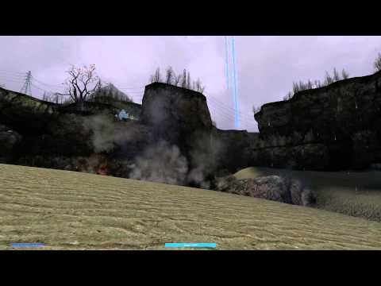

# Expression 2 - [E2] Orbital Bombardment

## Details

### Author

- Author: thewhitish
- YouTube: https://www.youtube.com/@nathansmith9820
- YouTube: https://www.youtube.com/@thewhitish

### Publication Info

- Title: [E2] Bounding mine deployer, personal energy shield, orbital bombardment, pocket sand
- Date (dd-mm-yyyy): 17-05-2014
- Source: https://web.archive.org/web/20160414093518/http://www.wiremod.com:80/forum/finished-contraptions/33053-bounding-mine-deployer-personal-energy-shield-orbital-bombardment-pocket-sand.html
- Source Accessed (dd-mm-yyyy): 29-08-2025

## Description

> [!Note]
> Part of a pack

All of these chips have a single button input, which is coded into the chip and can be changed or disabled (see the Key variable at the top of each chip). They also have one input that is designed to be wired to a momentary numpad input (not toggle) or pod controller, which can replace the internal button.

---

### Orbital Bombardment

Rain explosive props from the sky, with some pretty neat visuals and audio. Highly customizable, with adjustable radius, salvo size, and rate.

The button (default M) has to be held down for a short time. Tapping might not always work.

<!-- https://web.archive.org/web/20161010171318/https://www.youtube.com/watch?v=0U7VJYDqxSs -->

