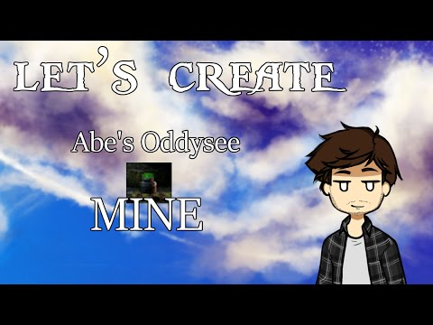

# Expression 2 - [E2 Tutorial] Let's Create! - Abe's oddysee Mine!

## Details

### Author

- Author: FailCake
- YouTube: https://www.youtube.com/@edunad
- Steam Profile: https://steamcommunity.com/profiles/76561198001836909
- Github: https://github.com/edunad

### Publication Info

- Title: [E2 Tutorial] Let's Create! - Abe's oddysee Mine!
- Date (dd-mm-yyyy): 30-07-2014
- Source: https://web.archive.org/web/20150429021515/http://www.wiremod.com:80/forum/finished-contraptions/33369-e2-tutorial-lets-create-abes-oddysee-mine.html
- Source: https://www.youtube.com/watch?v=b1C6sfQS5FA
- Source Accessed (dd-mm-yyyy): 29-08-2025

## Description

Hai wiremod! Long time no see!
I've decided to create a serie called Let's Create, ill be creating random expression2s for the first time while recording it!

I've re-created the Abe's oddysee Mine.

[YouTube - \[GMOD\]\[#1\] Let's Create! - Abe's oddysee Mine!](https://www.youtube.com/watch?v=b1C6sfQS5FA)

The code might not be optimized! Im sorry about that, it was my first "tutorial" video
