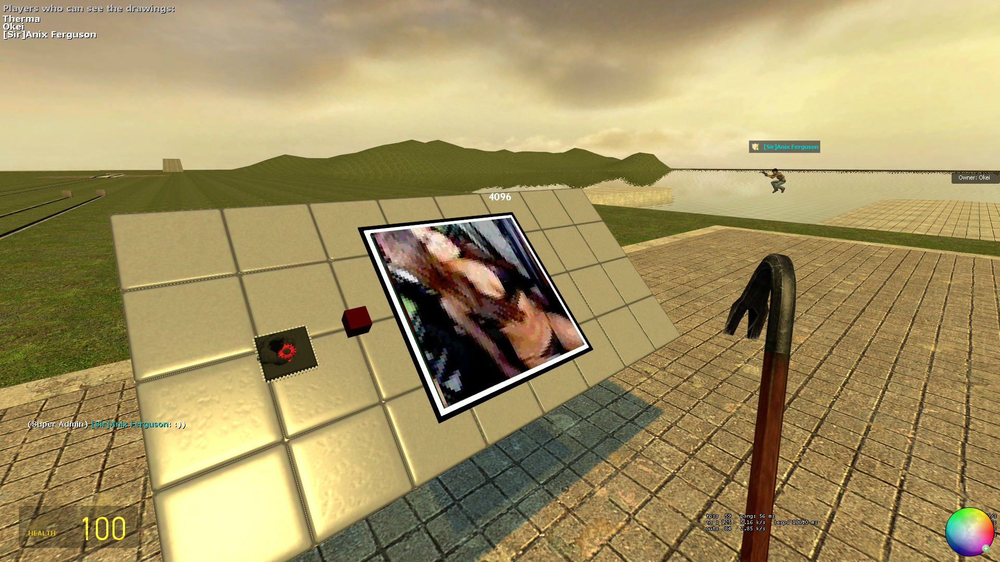

# Expression 2 - Image Writer

## Details

### Author

- Author: Okei
- Steam Profile: https://steamcommunity.com/profiles/76561198000970954

### Publication Info

- Title: Image Writer
- Date (dd-mm-yyyy): 29-04-2012
- Source: https://web.archive.org/web/20160308113708/http://www.wiremod.com/forum/finished-contraptions/29432-image-writer.html
- Source Accessed (dd-mm-yyyy): 30-08-2025

## Description

### HOW TO USE

1. Spawn the chip
2. Spawn a digital screen.
3. Wire digi from chip to the digital screen.

### ATTENTION!

- Max Resolution: 128x128  
- Supports only .png format.  
- The code is old and messy as fawx.  

