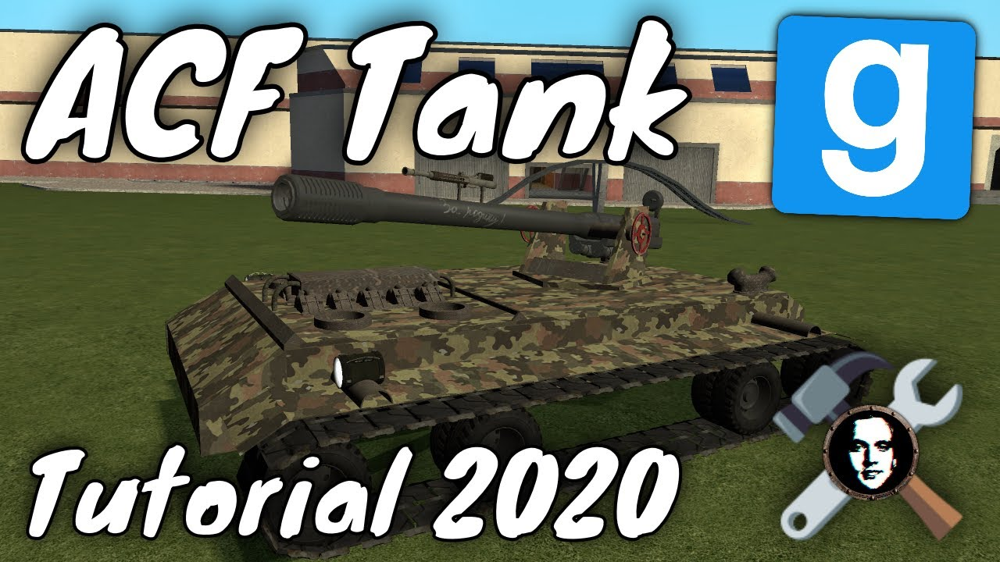

# Pack - ACF Tank Tutorial 2020 + Mouse Aim Turret With Ballistics Calculator

## Details

### Author

- Author: GMODISM
- Steam Profile: http://steamcommunity.com/profiles/76561198056037449
- YouTube: https://www.youtube.com/Gmodism
- Website: https://gmodism.com
- Reddit: https://www.reddit.com/r/GMODISM/
- Pastebin: https://pastebin.com/u/Gmodism

### Publication Info

- Title: Garry's Mod ACF Tank Tutorial 2020 + Mouse Aim Turret With Ballistics Calculator
- Date (dd-mm-yyyy): 04-10-2020
- Source: https://www.youtube.com/watch?v=2AWomepPfqA
- Source: https://www.mediafire.com/file/dqafrqqzn0n6sp7/chipsAndDupe.zip/file
- Source Accessed (dd-mm-yyyy): 09-09-2025
- Pack Type: advdupe2, expression2

## Description

Video:  
[YouTube - Garry's Mod ACF Tank Tutorial 2020 + Mouse Aim Turret With Ballistics Calculator](https://www.youtube.com/watch?v=2AWomepPfqA)

Gmod tutorial on how you can build a ACF tank with a mouse aim turret that has ballistics calculations and can hit targets far away accurately. Hope this Garry's Mod tutorial is useful, I know it is live very long but I just wanted to explain as much ass possible so that the builder understand the most possible, here it is anyways, finally after many years, a new tank tutorial!

Download RDC's chips, and a dupelication of this very tank for reference and testing here:  
https://www.mediafire.com/file/dqafrqqzn0n6sp7/chipsAndDupe.zip/file
