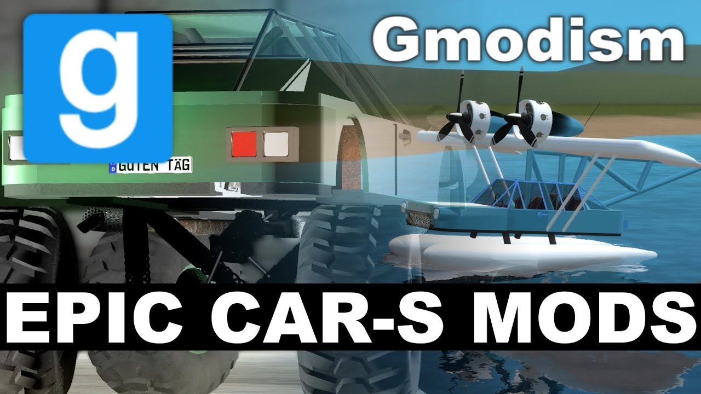

# Pack - ACF Car-S - Community Challenge Result - Who won? You Decide!

## Details

### Author

- Author: GMODISM
- Steam Profile: http://steamcommunity.com/profiles/76561198056037449
- YouTube: https://www.youtube.com/Gmodism
- Website: https://gmodism.com
- Reddit: https://www.reddit.com/r/GMODISM/
- Pastebin: https://pastebin.com/u/Gmodism

### Publication Info

- Title: Garry's Mod - ACF Car-S - Community Challenge Result - Who won? You Decide!
- Date (dd-mm-yyyy): 18-03-2018
- Source: https://www.youtube.com/watch?v=TowkUy26GyQ
- Source: https://www.mediafire.com/folder/hy0ru085a3ogo/Gmod_things
- Source: https://www.mediafire.com/file/d9hctb697i5szv8/ACF-Car-S_MODS.zip/file
- Source Accessed (dd-mm-yyyy): 18-07-2025
- Pack Type: advdupe2

## Description

Video:  
[YouTube - Garry's Mod - ACF Car-S - Community Challenge Result - Who won? You Decide!](https://www.youtube.com/watch?v=TowkUy26GyQ)

Finally I present to you 2 fantastic modifications of the car-s, as promised in the community challenge video here:    • Garry's Mod - ACF Car Build & Modification...  
This video presents the results, the fantastic flying boat by Sage, and the monstrous moster truck by Jollan, he also made the climbing track that can be enjoyed with the car.  
The still pictures of the cars, are taken by the authors themselves.
Hope you will enjoy these and this video concluding the event as well :)

Download these 2 awesome cars, and the rock climb track here: https://www.mediafire.com/file/d9hctb697i5szv8/ACF-Car-S_MODS.zip/file

More information about the original car-s, where to download it if you don't have them and some tricks how to change engine (the wheels are ballsocketed into the engine) Look at the release video and the handbook here:  

- [Garry's Mod: GI Car-S Model S70, Your Offi...](https://www.youtube.com/watch?v=Mi7664UZ0YY)
- [Garry's Mod: Car-S Model S70 Adv.Dupe Rele...](https://www.youtube.com/watch?v=rAdCcZuUwpQ)
