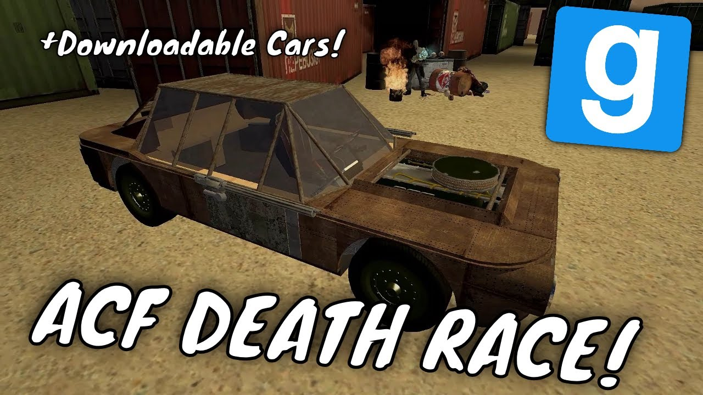

# Pack - ACF Death Race - Event & Showcase - Dupe Release Party 13

## Details

### Author

- Author: GMODISM
- Steam Profile: http://steamcommunity.com/profiles/76561198056037449
- YouTube: https://www.youtube.com/Gmodism
- Website: https://gmodism.com
- Reddit: https://www.reddit.com/r/GMODISM/
- Pastebin: https://pastebin.com/u/Gmodism

### Publication Info

- Title: Garry's Mod ACF Death Race - Event & Showcase - Dupe Release Party 13
- Date (dd-mm-yyyy): 13-07-2019
- Source: https://www.youtube.com/watch?v=JFyVaNU833Y
- Source: https://www.mediafire.com/folder/hy0ru085a3ogo/Gmod_things
- Source: https://www.mediafire.com/file/j5q7n5blsijninz/Deathrace.zip/file
- Source Accessed (dd-mm-yyyy): 18-07-2025
- Pack Type: advdupe2

## Description

Video:  
[YouTube - Garry's Mod ACF Death Race - Event & Showcase - Dupe Release Party 13](https://www.youtube.com/watch?v=JFyVaNU833Y)

We are trying to start some good old ACF deathrace, mad max apocalypse style, if you are willing come on and join us for a future race! :)  
We got our server, the Total Nerds where these events will be hosted, join the Gmod discord .role and get pinged when it's happening next time, or, make it happen by asking others, resources are posted below.

**RULES:** ACF (ACE) Deathrace!  
Rules: max 5 tonnes, only ACF (ACE only) propulsion, must have wheels. No fins anywhere.  
Must be rusty. You may bring several vehicles!  
All guns must be aimed manually. (probably only fixed guns)  
Think: is this fair? = OK, honesty and sense of fairness is our most important rule.

**RULES:** HEAVY: We noticed that these cars are very weak, which may be fun indeed but if many will want heavier cars, abide buy above rules but tonnage for HEAVY cars are 15 tonnes.  
If you use a heavy car, inform the other players and ask for permission as the above rules are default. Also, pleas refrain from just using tanks..... this is a reason we want guns fixed, trust me, it's very fun!
