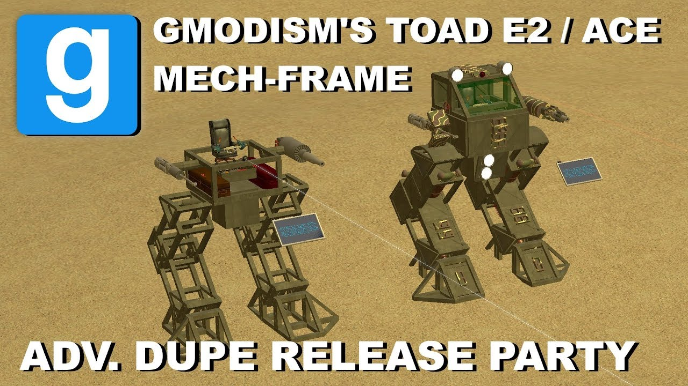

# Pack - Customizable Mech Frame System TOAD - Dupe Release Party 12 (E2, ACF/ACE)

## Details

### Author

- Author: GMODISM
- Steam Profile: http://steamcommunity.com/profiles/76561198056037449
- YouTube: https://www.youtube.com/Gmodism
- Website: https://gmodism.com
- Reddit: https://www.reddit.com/r/GMODISM/
- Pastebin: https://pastebin.com/u/Gmodism

### Publication Info

- Title: Garry's Mod - Customizable Mech Frame System TOAD - Dupe Release Party 12 (E2, ACF/ACE)
- Date (dd-mm-yyyy): 18-12-2019
- Source: https://www.youtube.com/watch?v=4C96rY7z7vA
- Source: https://drive.google.com/file/d/153Q_xi-jWESergUkYX8hbQedmalizFVL/edit
- Source Accessed (dd-mm-yyyy): 18-07-2025
- Pack Type: advdupe2

## Description

Video:  
[YouTube - Garry's Mod - Customizable Mech Frame System TOAD - Dupe Release Party 12 (E2, ACF/ACE)](https://www.youtube.com/watch?v=4C96rY7z7vA)

The ACF/ACE mech framework is finally done! This serves as a framework to quickly build and customize high tech mechs. The main pack includes a framework and a simple stock example mech, they are similar, very similar.  
The framework uses a ranger to calculate hit points of the ACF guns, does not work for missiles. The ranger can be unwelded and moved, or made invisible if you don't wanna see the ray, if so, you can place it directly in front of your head.  
HUD and ballistic chips have support for max 6 Guns, more of same gun can be used however. Guns need to be linked up with adv entity linker, and to one of the ballistic chips.  
Mech might need to be repasted when guns have been updated, or the HUD chips code reloaded.  
Look for instructions in the HUD chip on how to customize it, good intro to some coding btw.  
If you want detailed info on E2 mechs using this BFW6 walker chip, check my earlier tutorial linked below.

Download the CMFS TOAD pack: https://drive.google.com/file/d/153Q_xi-jWESergUkYX8hbQedmalizFVL/edit

NEEDED ADDONS:

- Wiremod
- ACF or ACE
- maybe S-props? Maybe

INSTALLATION: Place the dupe files inside the Adv Dupelicator 2 folder.  
Here is common location of the dupe folder:  
C:\Program Files (x86)\Steam\SteamApps\common\GarrysMod\garrysmod\data\advdupe2\  
Unpack the ZIP and place folder in there :)

Huge thanks to Setsze who made the walking chip, to RDC who made the Mech HUD chip, especially for this mech project and more.  
And special Thanks to Our Patrons: Tram Streve & Marty McBacon.

E2 Mech tutorial: [• [Tutorial] Garry's Mod: How to Build a E2 ...](https://www.youtube.com/watch?v=tM9wwLsdn30)
Dedicated ACF Mech tutorial: [• [Tutorial] Garry's Mod: ACF E2 Mech Tutori...](https://www.youtube.com/watch?v=pGzVxoWRw0w)
